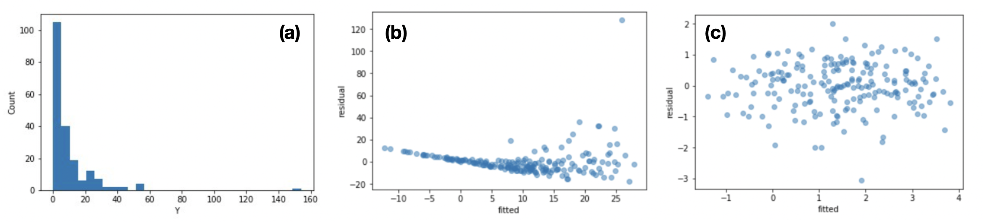
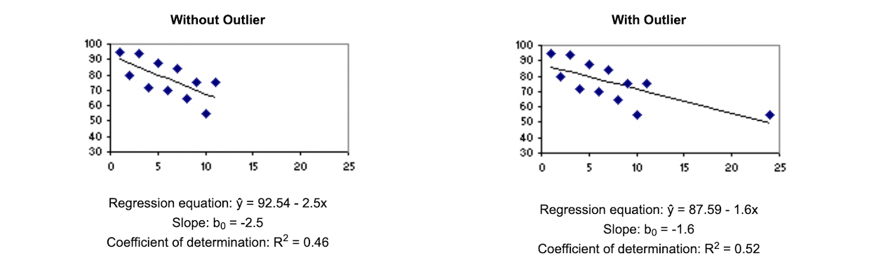

# Regression 

Regression is to model when the target variable $y$ is numeric, continuous

$$y = f(x)$$

Designate $m$ is the number of data points and the data is $D$, the cost function for regression reads

$$C(D) = \sum^m_{i=1} (y_i - \hat{y}_i)^2,$$

where $\hat{y}_i = \bold{x}_i \theta$  is the predicted value, and residuals are defined as the difference between the actual value $y_i$ and the predicted value:

$$e_i = \hat{y}_i - y_i.$$

The optimization objective is to minimize the cost function. 

Table of Contents:

* [1. Metric](https://github.com/HsiangHung/Machine_Learning_Note/tree/master/Regression#1-metric)
     * [1.1 MSE (mean squared errors) and RMSE (squared-rooted MSE)](https://github.com/HsiangHung/Machine_Learning_Note/tree/master/Regression#12-mae-mean-absolute-error)
     * [1.2 MAE (Mean absolute error)](https://github.com/HsiangHung/Machine_Learning_Note/tree/master/Regression#12-mae-mean-absolute-error)
     * [1.3 R-squared](https://github.com/HsiangHung/Machine_Learning_Note/tree/master/Regression#13-r-squared)
     * [1.4 Adjusted R-squared](https://github.com/HsiangHung/Machine_Learning_Note/tree/master/Regression#14-adjusted-r-squared)
* [2. Linear Regression](https://github.com/HsiangHung/Machine_Learning_Note/tree/master/Regression#2-linear-regression)
     * [2.1 Assumption for linear regression](https://github.com/HsiangHung/Machine_Learning_Note/tree/master/Regression#21-assumption-for-linear-regression)
     * [2.2 Maximum likelihood estimate](https://github.com/HsiangHung/Machine_Learning_Note/tree/master/Regression#22-maximum-likelihood-estimate)
     * [2.3 Interpret Regression Analysis Results: P-values and Coefficients](https://github.com/HsiangHung/Machine_Learning_Note/tree/master/Regression#23-interpret-regression-analysis-results-p-values-and-coefficients)
* [3. Multicollinearity](https://github.com/HsiangHung/Machine_Learning_Note/tree/master/Regression#3-multicollinearity)
     * [3.1 How to test Multicollinearity?](https://github.com/HsiangHung/Machine_Learning_Note/tree/master/Regression#31-how-to-test-multicollinearity)
     * [3.2 How to deal with Multicollinearity](https://github.com/HsiangHung/Machine_Learning_Note/tree/master/Regression#32-how-to-deal-with-multicollinearity)
* [4. Effects of an Outlier on Regression](https://github.com/HsiangHung/Machine_Learning_Note/tree/master/Regression#4-effects-of-an-outlier-on-regression)
* [5. Deep learning for regression](https://github.com/HsiangHung/Machine_Learning_Note/tree/master/Regression#5-deep-learning-for-regression)

## 1. Metric

There are other measurements to evaluate regression models.

### 1.1  MSE (mean squared errors) and RMSE (squared-rooted MSE) 

MSE and RMSE penalizes the large prediction errors vi-a-vis Mean Absolute Error (MAE). RMSE is widely used than MSE to evaluate the performance of the regression model with other random models as it has the same units as the dependent variable [[Akshita Chugh]][MAE, MSE, RMSE, Coefficient of Determination, Adjusted R Squared — Which Metric is Better?].

MSE is a differentiable function that makes it easy to perform mathematical operations in comparison to a non-differentiable function like MAE [[Akshita Chugh]][MAE, MSE, RMSE, Coefficient of Determination, Adjusted R Squared — Which Metric is Better?].

### 1.2 MAE (Mean absolute error)

MAE is more robust to data with outliers [[Akshita Chugh]][MAE, MSE, RMSE, Coefficient of Determination, Adjusted R Squared — Which Metric is Better?].

### 1.3 R-squared

R-squared statistic or coefficient of determination is a scale invariant statistic that gives the proportion of variation in target variable explained by the linear regression model. [[Aniruddha Bhandari]][Analytics Vidhya: Key Difference between R-squared and Adjusted R-squared for Regression Analysis]

For R-sqaured, we need RSS and TSS. **Residual sum of squares (RSS)** is equal to the cost function:

The lower the value of RSS, the better is the model predictions. **Total Sum of Squares (TSS)** is 

TSS or Total sum of squares gives the total variation in target variable `y`.

TSS-RSS gives us how much variation in `y` is explained by our model. R-squared is the ratio with repect to total variance explained by model:

`RSS/TSS` is the variance in `y` **NOT** explained by the model.

0 <= R-squared <= 1. If this value is 0.7, it means that the **independent variables explain 70% of the variation in the target variable**. A higher R-squared value indicates a higher amount of variability being explained by our model and vice-versa: a better model, lower RSS value, higher R-sqaured values.

### 1.4 Adjusted R-squared

A major problem is that R-sqaured is related to the number of variables we add to our regression model. That is, even if we are adding redundant variables to the data, the value of R-squared does not decrease. This clearly does not make sense because some of the independent variables might not be useful in determining the target variable. 

The adjusted R-squared compares the descriptive power of regression models that include diverse numbers of predictors. [[Aniruddha Bhandari]][Analytics Vidhya: Key Difference between R-squared and Adjusted R-squared for Regression Analysis]:

Thus, if R-squared does not increase significantly on the addition of a new independent variable (higher `p`), then `1/(m-p-1)` increases and Adjusted R-squared will actually decrease. In other words, adjusted R squared takes into account the number of predictor variables.

On the other hand, if on adding the new independent variable we see a significant increase in R-squared value, then the Adjusted R-squared value will also increase.

### 1.5 Other regression loss function

There are other loss functions, like **Huber loss** and **quantile loss functions** [[Prince Grover]][5 Regression Loss Functions All Machine Learners Should Know].

Quantile loss functions turn out to be useful when we are interested in predicting an interval instead of only point predictions.

### Reference

* [MAE, MSE, RMSE, Coefficient of Determination, Adjusted R Squared — Which Metric is Better?]: https://medium.com/analytics-vidhya/mae-mse-rmse-coefficient-of-determination-adjusted-r-squared-which-metric-is-better-cd0326a5697e
[[Akshita Chugh] MAE, MSE, RMSE, Coefficient of Determination, Adjusted R Squared — Which Metric is Better?](https://medium.com/analytics-vidhya/mae-mse-rmse-coefficient-of-determination-adjusted-r-squared-which-metric-is-better-cd0326a5697e)
* [Analytics Vidhya: Key Difference between R-squared and Adjusted R-squared for Regression Analysis]: https://www.analyticsvidhya.com/blog/2020/07/difference-between-r-squared-and-adjusted-r-squared/
[[Aniruddha Bhandari] Analytics Vidhya: Key Difference between R-squared and Adjusted R-squared for Regression Analysis](https://www.analyticsvidhya.com/blog/2020/07/difference-between-r-squared-and-adjusted-r-squared/)
* [5 Regression Loss Functions All Machine Learners Should Know]: https://heartbeat.comet.ml/5-regression-loss-functions-all-machine-learners-should-know-4fb140e9d4b0
[[Prince Grover] 5 Regression Loss Functions All Machine Learners Should Know](https://heartbeat.comet.ml/5-regression-loss-functions-all-machine-learners-should-know-4fb140e9d4b0)
* [Quroa: What is the difference between R-squared and Adjusted R-squared?]: https://www.quora.com/What-is-the-difference-between-R-squared-and-Adjusted-R-squared
[[Quora: What is the difference between R-squared and Adjusted R-squared?] Quora: What is the difference between R-squared and Adjusted R-squared?](https://www.quora.com/What-is-the-difference-between-R-squared-and-Adjusted-R-squared)

## 2. Linear Regression

The linear regression has a generic form

### 2.1 Assumption for linear regression

There are some assumptions associated with a linear regression model [[BUMC]][Simple Linear Regression], [[Genevieve Hayes]][The Pitfalls of Linear Regression and How to Avoid Them], [[Analytics Vidhya]][Going Deeper into Regression Analysis with Assumptions, Plots & Solutions]:

* **Independence**: Observations are independent of each other, i.e. no **autocorrelation** in our output variable. The presence of autocorrelation in error terms drastically reduces model’s accuracy, and the estimated standard errors tend to underestimate the true standard error. Use Durbin – Watson (DW) statistic to check autocorrelation: DW = 2 implies no autocorrelation; 0 < DW < 2  positive autocorrelation; 2 < DW < 4 indicates negative autocorrelation [[Analytics Vidhya]][Going Deeper into Regression Analysis with Assumptions, Plots & Solutions].

As an example, the above value vs time plot clearly shows autocorrelation present in the data [in (a)]. If we did try to fit a linear regression model to this data, using Year and Month as our input variables, we would end up with the red line in (b). In order to deal with the autocorrelation, we need to use a model which is specifically designed for dealing with time series, such as an ARIMA model. As shown in (c), the orange line fitted by ARIMA(5, 1, 0) provides a good forecast [[Genevieve Hayes]][The Pitfalls of Linear Regression and How to Avoid Them].

* **Linearity**: The relationship between X and the mean of Y is linear. Look for **residual vs fitted value** plots. To fix this, you can include polynomial terms (`X`, `X^2`, `X^3`) or interaction terms in your model to capture the non-linear effect (credit from [[Analytics Vidhya]][Going Deeper into Regression Analysis with Assumptions, Plots & Solutions]).

* **Homoscedasticity**: The variance of residual is the same for any value of X, i.e. error terms must have constant variance. The presence of non-constant variance in the error terms results in heteroskedasticity (see below) (credit from [[Analytics Vidhya]][Going Deeper into Regression Analysis with Assumptions, Plots & Solutions]).

* **Normality**: For any fixed value of X, Y is normally distributed.  If the data comes from a normal distribution, the plot would show fairly straight line. Absence of normality in the errors can be seen with deviation in the straight line (credit from [[Analytics Vidhya]][Going Deeper into Regression Analysis with Assumptions, Plots & Solutions]).

For example, skewed data leads to normality violation, below (a). If we fit a linear regression model to this dataset **without** transforming our output variable, we will see heteroskedasticity in the fitted values vs residual plot, in (b). But if we **log transform** our output variable prior to fitting our model, the residuals show homoskedasticity, in below (c) [[Genevieve Hayes]][The Pitfalls of Linear Regression and How to Avoid Them]. 

Alternatively, we can fit a model that is specifically designed for non-normal data, such as a **generalized linear model (GLM)**. The blog [Beyond Linear Regression: An Introduction to GLMs](https://towardsdatascience.com/beyond-linear-regression-an-introduction-to-glms-7ae64a8fad9c) discusses GLMs in detail. In the case of positively skewed data, a gamma GLM is typically the best choice.

In [[Genevieve Hayes]][The Pitfalls of Linear Regression and How to Avoid Them], the author additionally listed another key assumption for linear regression: 

* **No multicollinearity**: none of input variables are highly positively or negatively correlated with one another. 

However I don't think multicollinearity does hurt regression model (but does impact to the model interpretation). We have more comprehensive discussion in later section.

### 2.2 Maximum likelihood estimate

Given a model `θ`, the likelihood of having a data point `(xi, yi)` is a normal distribution as

Thus the total likelihood of having the entire dataset `D={(x1, y1), (x2, y2),..}` is

The following is the picture, credit from Prof. Nando de Freitas's UBC Machine learning class. For each x, the likelihood of having y is described normal distribution, and the mean value is the linear fit:

### 2.3 Interpret Regression Analysis Results: P-values and Coefficients

The p-value for each term tests the **null hypothesis that the coefficient is equal to zero (no effect)**. A low p-value (< 0.05) indicates that you can reject the null hypothesis. In other words, a predictor that has a low p-value is likely to be a meaningful addition to your model because changes in the predictor's value are related to changes in the response variable [[Minitab Blog-pvalue]][How to Interpret Regression Analysis Results: P-values and Coefficients].

Conversely, a larger (insignificant) p-value suggests that changes in the predictor are not associated with changes in the response.

In the output below, we can see that the predictor variables of South and North are significant because both of their p-values are 0.000. However, the p-value for East (0.092) is greater than the common alpha level of 0.05, which indicates that it is not statistically significant.

Table with regression p-values [[Minitab Blog-pvalue]][How to Interpret Regression Analysis Results: P-values and Coefficients]

Typically, you use the coefficient p-values to determine which terms to keep in the regression model. In the model above, we should consider removing East.

### Reference

* [Going Deeper into Regression Analysis with Assumptions, Plots & Solutions]: https://www.analyticsvidhya.com/blog/2016/07/deeper-regression-analysis-assumptions-plots-solutions/
[[Analytics Vidhya] Going Deeper into Regression Analysis with Assumptions, Plots & Solutions](https://www.analyticsvidhya.com/blog/2016/07/deeper-regression-analysis-assumptions-plots-solutions/)
* [Simple Linear Regression]: https://sphweb.bumc.bu.edu/otlt/MPH-Modules/BS/R/R5_Correlation-Regression/R5_Correlation-Regression4.html
[[BUMC] Simple Linear Regression](https://sphweb.bumc.bu.edu/otlt/MPH-Modules/BS/R/R5_Correlation-Regression/R5_Correlation-Regression4.html)
* [The Pitfalls of Linear Regression and How to Avoid Them]: https://medium.com/analytics-vidhya/the-pitfalls-of-linear-regression-and-how-to-avoid-them-b93626e1a020
[[Genevieve Hayes] The Pitfalls of Linear Regression and How to Avoid Them](https://medium.com/analytics-vidhya/the-pitfalls-of-linear-regression-and-how-to-avoid-them-b93626e1a020)
* [How to Interpret Regression Analysis Results: P-values and Coefficients]: https://blog.minitab.com/en/adventures-in-statistics-2/how-to-interpret-regression-analysis-results-p-values-and-coefficients
[[Minitab Blog-pvalue] How to Interpret Regression Analysis Results: P-values and Coefficients](https://blog.minitab.com/en/adventures-in-statistics-2/how-to-interpret-regression-analysis-results-p-values-and-coefficients)

## 3. Multicollinearity

**Collinearity** occurs when two predictor variables (e.g., x1 and x2) in a multiple regression have a non-zero correlation. **Multicollinearity** is when more than twp input predictors (variables) are highly positively or negatively correlated with one another, usually (absolute) correlation coefficient greater than 0.8 [[Psychological Statistics]][Multicollinearity and collinearity (in multiple regression) - a tutorial].

Multicollinearity causes the following two basic types of problems:

1. The coefficient estimates can swing wildly based on which other independent variables are in the model. The coefficients become very sensitive to small changes in the model.
2. Multicollinearity reduces the precision of the estimate coefficients, which weakens the statistical power of your regression model. You might not be able to trust the p-values to identify independent variables that are statistically significant.

Severe multicollinearity is a major problem, because it increases the variance of the regression coefficients, making them unstable. The more variance they have, the **more difficult it is to interpret the coefficients**.

### 3.1 How to test Multicollinearity?

1. Correlation matrix / Correlation plot
2. **Variation Inflation Factor (VIF)**: identifies correlation between independent variables and the strength of that correlation. 

The VIF for the `j`-th predictor is [[Penn stat: STAT 462 - Applied Regression Analysis]][10.7 - Detecting Multicollinearity Using Variance Inflation Factors]:

where  is the R-sqaured value obtained by regressing the `j`-th predictor on the remaining predictors.

| VIF | judgement | 
| --- | --- | 
| 1 |  No correlation | 
| 1-5 |  Moderate correlation   | 
| >10 |  High correlation  |  

### 3.2 How to deal with Multicollinearity

* **Remove highly correlated predictors from the model**: If you have two or more factors with a high VIF, remove one from the model. Consider using stepwise regression, best subsets regression, or specialized knowledge of the data set to remove these variables. Select the model that has the highest R-squared value [[Minitab Blog-Multicollinearity]][Enough Is Enough! Handling Multicollinearity in Regression Analysis]. 

* **combine variables**: Use Partial Least Squares Regression (PLS) or **Principal Components Analysis**, regression methods that cut the number of predictors to a smaller set of uncorrelated components [[Minitab Blog-Multicollinearity]][Enough Is Enough! Handling Multicollinearity in Regression Analysis], [[Sushmitha Pulagam]][How to detect and deal with Multicollinearity].

Some notes by [[Jim Frost]][Multicollinearity in Regression Analysis: Problems, Detection, and Solutions]:

1. The severity of the problems increases with the degree of the multicollinearity. Therefore, if you have only moderate multicollinearity, you may not need to resolve it.
2. Multicollinearity affects only the specific independent variables that are correlated. Therefore, if multicollinearity is not present for the independent variables that you are particularly interested in, you may not need to resolve it. Suppose your model contains the experimental variables of interest and some control variables. If high multicollinearity exists for the control variables but not the experimental variables, then you can interpret the experimental variables without problems.
3. Multicollinearity affects the coefficients and p-values, but it does not influence the predictions, precision of the predictions, and the goodness-of-fit statistics. **If your primary goal is to make predictions, and you don’t need to understand the role of each independent variable, you don’t need to reduce severe multicollinearity**.

### Reference

* [10.7 - Detecting Multicollinearity Using Variance Inflation Factors]: https://online.stat.psu.edu/stat462/node/180/
[[Penn stat: STAT 462 - Applied Regression Analysis] 10.7 - Detecting Multicollinearity Using Variance Inflation Factors](https://online.stat.psu.edu/stat462/node/180/)
* [Multicollinearity in Regression Analysis: Problems, Detection, and Solutions]: https://statisticsbyjim.com/regression/multicollinearity-in-regression-analysis/
[[Jim Frost] Multicollinearity in Regression Analysis: Problems, Detection, and Solutions](https://statisticsbyjim.com/regression/multicollinearity-in-regression-analysis/)
* [Enough Is Enough! Handling Multicollinearity in Regression Analysis]: https://blog.minitab.com/en/understanding-statistics/handling-multicollinearity-in-regression-analysis
[[Minitab Blog-Multicollinearity] Enough Is Enough! Handling Multicollinearity in Regression Analysis](https://blog.minitab.com/en/understanding-statistics/handling-multicollinearity-in-regression-analysis)
* [Multicollinearity and collinearity (in multiple regression) - a tutorial]: http://psychologicalstatistics.blogspot.com/2013/11/multicollinearity-and-collinearity-in.html
[[Psychological Statistics] Multicollinearity and collinearity (in multiple regression) - a tutorial](http://psychologicalstatistics.blogspot.com/2013/11/multicollinearity-and-collinearity-in.html)
* [How to detect and deal with Multicollinearity]: https://towardsdatascience.com/how-to-detect-and-deal-with-multicollinearity-9e02b18695f1
[[Sushmitha Pulagam] How to detect and deal with Multicollinearity](https://towardsdatascience.com/how-to-detect-and-deal-with-multicollinearity-9e02b18695f1)

## 4. Effects of an Outlier on Regression

An influential point is an outlier that greatly affects the slope of the regression line. One way to test the influence of an outlier is to compute the regression equation with and without the outlier. The types of analysis are illustrated below [[Stat Trek]][Influential Points]:

### 4.1 Example A

When the outlier is present, the slope is flatter (-4.10 vs. -3.32); so this outlier would be considered an influential point.

### 4.2 Example B

The slope of the regression line changes greatly, from -2.5 to -1.6; so the outlier would be considered an influential point too.

Sometimes, an influential point will cause the coefficient of determination (R-squared) to be bigger; sometimes, smaller. In the first example above, the coefficient of determination is bigger when the influential point is present (0.94 vs. 0.55). In the second example, it is smaller (0.46 vs. 0.52). When the data set is very large, a single outlier may not have a big effect on the regression equation.

If your data set includes an influential point, here are some things to consider [[Stat Trek]][Influential Points]:

* An influential point may represent bad data, possibly the result of measurement error. If possible, check the validity of the data point.
* Compare the decisions that would be made based on regression equations defined with and without the influential point. If the equations lead to contrary decisions, use caution.

### Reference

* [Influential Points]: https://stattrek.com/regression/influential-points.aspx
[[Stat Trek] Influential Points](https://stattrek.com/regression/influential-points.aspx)

## 5. Deep Learning for Regression

California house price prediction from Kaggle:

1. [House-Price-Prediction-Regression-with-Tensorflow-Keras-](https://github.com/Harshita9511/House-Price-Prediction-Regression-with-Tensorflow-Keras-/blob/master/Housing_Price_Prediction_(Regression)_with_Tensorflow_Keras.ipynb)
2. [Kaggle-California-Housing-Prices](https://github.com/mohitgupta-omg/Kaggle-California-Housing-Prices/blob/master/k%20California%20Housing%20Prices.ipynb)
3. [My github](https://github.com/HsiangHung/Deep-Learning/blob/master/regression/Regression%20NN.ipynb)

