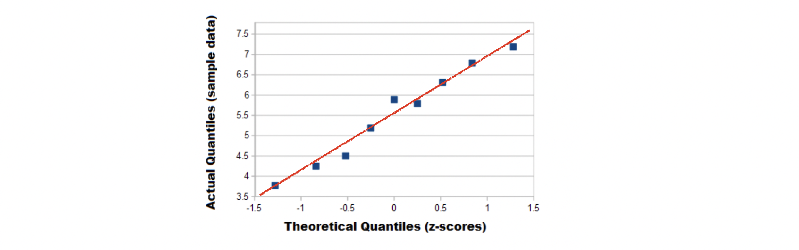

# Q Q Plot

Q Q Plots (Quantile-Quantile plots) are plots of two quantiles against each other. A quantile is a fraction where certain values fall below that quantile (5%, 10%,...99%). The purpose of Q Q plots is to find out if two sets of data come from the same distribution. A 45 degree angle is plotted on the Q Q plot; if the two data sets come from a common distribution, the points will fall on that reference line [[Statistics How To]][Q Q Plots: Simple Definition & Example].

You can use any continuous distribution (not only limited to **normal distribitopn**) as a comparison, for example, a Weibull distribution, a lognormal distribution or a uniform distribution, as long as you can calculate the quantiles. In fact, a common procedure is to test out several different distributions with the Q Q plot to see if one fits your data well.

There is a tutorial video: [StatQuest: Quantile-Quantile Plots (QQ plots), Clearly Explained
](https://www.youtube.com/watch?v=okjYjClSjOg).

## How to Make a Q Q Plot

Sample question: Do the following values come from a **normal** distribution?

    7.19, 6.31, 5.89, 4.5, 3.77, 4.25, 5.19, 5.79, 6.79

## Step 1 
Order the items from smallest to largest.

    3.77, 4.25, 4.50, 5.19, 5.89, 5.79, 6.31, 6.79, 7.19

## Step 2
Draw a normal distribution curve. Divide the curve into n+1 segments. We have 9 values, so divide the curve into 10 equally-sized areas. For this example, each segment is 10% of the area (because 100% / 10 = 10%).

## Step 3
Find the z-value (cut-off point) for each segment in Step 3. These segments are areas, so refer to a z-table (or use software) to get a z-value for each segment.
The z-values are:

   10% = -1.28, 20% = -0.84, 30% = -0.52, 40% = -0.25, 50% = 0, 
   60% = 0.25, 70% = 0.52, 80% = 0.84, 90% = 1.28, 100% = 3.0

## Step 4
Plot your data set values (Step 1) against your normal distribution cut-off points (Step 3); x-axis is the theoretical z-score percentile and y-axis is the percentile on data:

| percentile | Z score | data | 
| --- | --- | --- | 
| 10% | -1.28 | 3.77 |
| 20% | -0.84 | 4.25 | 
| 30% | -0.52 | 4.50 | 
| 40% | -0.25 | 5.19 | 
| 50% | 0 | 5.89 |
| 60% | 0.25 | 5.79 |
| 70% | 0.52 | 6.31 |
| 80% | 0.84 | 6.79 |
| 90% | 1.28 | 7.19 |

#### Reference

* [Q Q Plots: Simple Definition & Example]: https://www.statisticshowto.com/q-q-plots/
[[Statistics How To] Q Q Plots: Simple Definition & Example](https://www.statisticshowto.com/q-q-plots/)

