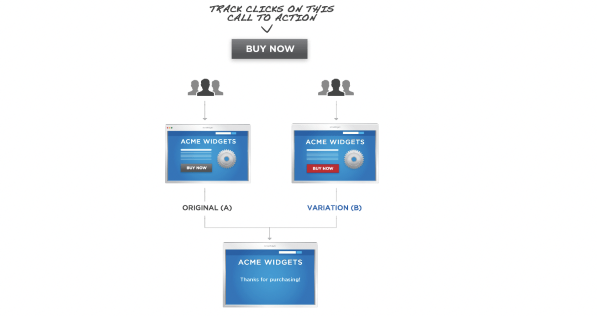
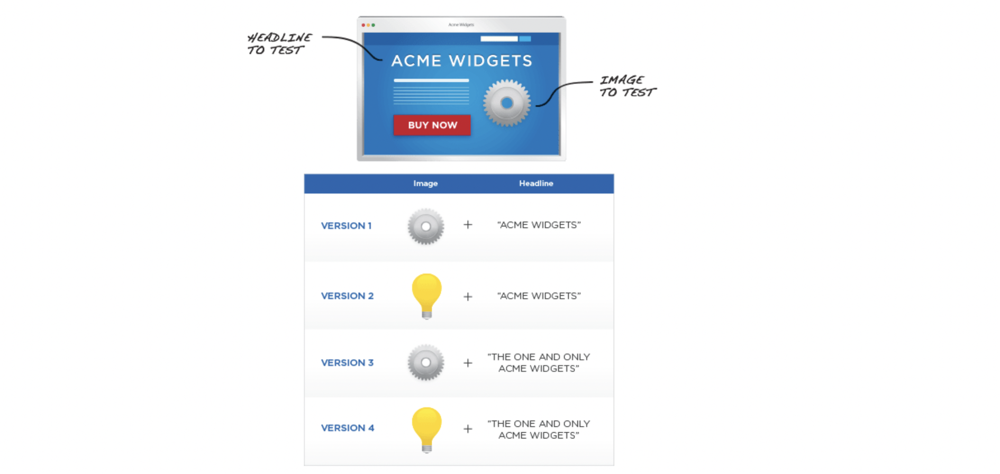

# Statistical Testing

The conversion matrix of testing is [[Massa]][S. Massa, Kolmogorov Smirnov Test & Power of Tests]

| Pred \ Actual | H0 is False | H0 is True | 
| :---: | :---: | :---: | 
| H0 is False |  |  | 
| H0 is True |  |  | 

where `Pred` means the statistical testing results. The type-I error 

 

is the probability, that given the null hypothesis is true you reject the hypothesis. On the other hand, the type-II error 

 

is the probability, that given the null hypothesis is false you fail to reject the hypothesis. 

Ideally, we want both lower , but also lower . 

 is the power. Higher power has more reliable statistical testing.

#### Reference

[S. Massa, Kolmogorov Smirnov Test & Power of Tests]: http://www.stats.ox.ac.uk/~massa/Lecture%2013.pdf
[[Massa] S. Massa, Kolmogorov Smirnov Test & Power of Tests](http://www.stats.ox.ac.uk/~massa/Lecture%2013.pdf)

## Effect size

### A. Difference family: Effect sizes based on differences between means

The effect size θ based on means usually considers the standardized mean difference between **two** populations [[wiki]][Wiki-Effect size, Effect size], [[Merra]][Merra, Power Analysis, Statistical Significance, & Effect Size]:

where μ1 is the mean for one population, μ2 is the mean for the other population, and σ is a standard deviation based on either or both populations. 

The above form for the effect size resembles the computation for a t-test statistic, except for that t-test statistic includes a factor of , which means that for a given effect size, the significance level increases with the sample size. Unlike the t-test statistic, the effect size here aims to estimate a population parameter and is **not** affected by the sample size.

### B. Correlation family: Effect sizes based on "variance explained"

These effect sizes estimate the amount of the variance within an experiment that is "explained" or "accounted for" by the experiment's model. Pearson's correlation, often denoted r and introduced by Karl Pearson, is widely used as an effect size when paired quantitative data are available[[wiki]][Wiki-Effect size, Effect size], [[statisticssolution]][statisticssolution, Effect Size].

| Effect size | r | 
| :---: | :---: | 
| Small | 0.1 |
| Medium | 0.3 |
| Large | 0.5 |

#### Reference

[Merra, Power Analysis, Statistical Significance, & Effect Size]: https://meera.snre.umich.edu/power-analysis-statistical-significance-effect-size#:~:text=Generally%2C%20effect%20size%20is%20calculated,of%20one%20of%20the%20groups.
[[Merra] Merra, Power Analysis, Statistical Significance, & Effect Size](https://meera.snre.umich.edu/power-analysis-statistical-significance-effect-size#:~:text=Generally%2C%20effect%20size%20is%20calculated,of%20one%20of%20the%20groups.)

[statisticssolution, Effect Size]: https://www.statisticssolutions.com/free-resources/directory-of-statistical-analyses/effect-size/
[[statisticssolution] statisticssolution, Effect Size](https://www.statisticssolutions.com/free-resources/directory-of-statistical-analyses/effect-size/)

[Wiki-Effect size, Effect size]: https://en.wikipedia.org/wiki/Effect_size
[[wiki] Wiki-Effect size, Effect size](https://en.wikipedia.org/wiki/Effect_size)

## Novelty Effect

The novelty effect happens: when you give users the chance to try a new feature, at first they might try it out just out of curiosity, even if the feature is not actually better. So, say you run a test for 2 weeks, you are actually capturing in those two weeks the phase in which customers are extensively using your feature just because it is **new** and they are **curious** [[Product Data Science]][Product Data Science, Novelty Effect].

Assume you check your test results and see, for instance, that engagement or time spent on site are way up for test vs control. So you give that feature to all users, but after some time you actually see a steep decline in engagement or time spent on site. This is a really really common issue especially on sites whose main metrics are related to clicks and time spent, like social networks or most businesses that make money via ads.

The problem is how to isolate the effect of the new feature vs the effect of novelty, which is unrelated to the new feature and always happens whenever a user sees something new. For instance, let’s say you run a test giving some users a lower price. How to isolate the effect of the lower price vs the excitement of getting a discount?

### A. Solution for novelty effect

The obvious solution for novelty effect would be to **run tests longer**, giving test users enough time to get rid of the novelty effect. However, that’s hardly efficient, and the cost of having to run tests for longer would probably outweigh the benefits coming from more reliable results.

Another way is to consider driving traffic for **new users only** to ensure the novelty effect doesn’t impact your results [[Instapage]][Instapage, 5 Common Threats to Your A/B Test’s Validity]. Returning visitors may attract more attention on the change, simply because it’s different than what they’re accustomed to. But new visitors have never seen your previous setup, so if it attracts their attention, it won’t be because they’re used to something different.

### B. Digression: Change aversion

The opposite to novelty effect also happens. That is, if you give users a new experience, at first they might hate it cause it is not what they are used to and they feel they have to re-learn how to use the product. This is called change aversion. However, in practice, this is a much smaller problem from an A/B testing standpoint because it only affects major product redesigns, which are rarer than small UI tweaks [[Product Data Science]][Product Data Science, Novelty Effect]. 

#### Reference

[Instapage, 5 Common Threats to Your A/B Test’s Validity]: https://instapage.com/blog/validating-ab-tests
[[Instapage] Instapage, 5 Common Threats to Your A/B Test’s Validity](https://instapage.com/blog/validating-ab-tests)

[Product Data Science, Novelty Effect]: https://productds.com/wp-content/uploads/Novelty_Effect.html
[[Product Data Science] Product Data Science, Novelty Effect](https://productds.com/wp-content/uploads/Novelty_Effect.html)

## A/B Testing

### Different Types of Test Design [[Exponente]][How to Ace A/B Testing Interview Questions]:

#### A/B/N

Another similar kind of test is the A/B/N test. In this kind of test, (usually, this kind of test is done for web pages) more than two versions are tested, whereas an A/B test only tests two versions against each other. The N in A/B/N stands for "number," meaning the number of versions being tested. A/B/N tests are similar to that of multivariate tests, except multivariate tests involve the testing of all possible combinations of the different **variables** at once, whereas A/B/N, does not. Rather, A/B/N is used to test several different **versions** against each other.

These forms of tests are best used for major layout or design decisions, rather than testing the individual differences between specific elements.

**Limitations** A/B testing is best used to measure the impact of **two to four** variables on interactions with the page. Tests with more variables take longer to run, and A/B testing will not reveal any information about interaction between variables on a single page [[Exponente]][How to Ace A/B Testing Interview Questions].

#### Multivariate testing

 A/B tests, as the name suggests, only compare two variables. If too many variables are included in an A/B test, it becomes difficult to discern why one version outperformed the other. When **multiple variables** are needed to be tested, multivariate testing is the way to go.

Multivariate testing is when all possible combinations of versions and all their variables are tested **at once**. This form of test design is best used when several product changes are to be decided. Rather than running dozens of A/B tests **on every single design change**, a multivariate test can be performed in which every possible combination is tested against each other.

For example, a page that includes a sign-up form, some kind of catchy header text, and a footer. To run a multivariate test on this page, rather than creating a radically different design as in A/B testing, you might create **two** different lengths of sign-up forms, **three** different headlines, and **two** footers. Next, you would funnel visitors to all possible combinations of these elements. This is also known as full factorial testing, and is one of the reasons why multivariate testing is often recommended only for sites that have a substantial amount of daily traffic — the more variations that need to be tested, the longer it takes to obtain meaningful data from the test.

**Limitation** The single biggest limitation of multivariate testing is the amount of traffic needed to complete the test. Since all experiments are fully factorial, too many changing elements at once can quickly add up to a very large number of possible combinations that must be tested. Even a site with fairly high traffic might have trouble completing a test with more than 25 combinations in a feasible amount of time [[Exponente]][How to Ace A/B Testing Interview Questions].

#### Reference

[How to Ace A/B Testing Interview Questions]: https://blog.tryexponent.com/how-to-ace-ab-testing-interview-questions/
[[Exponente] How to Ace A/B Testing Interview Questions](https://blog.tryexponent.com/how-to-ace-ab-testing-interview-questions/)
