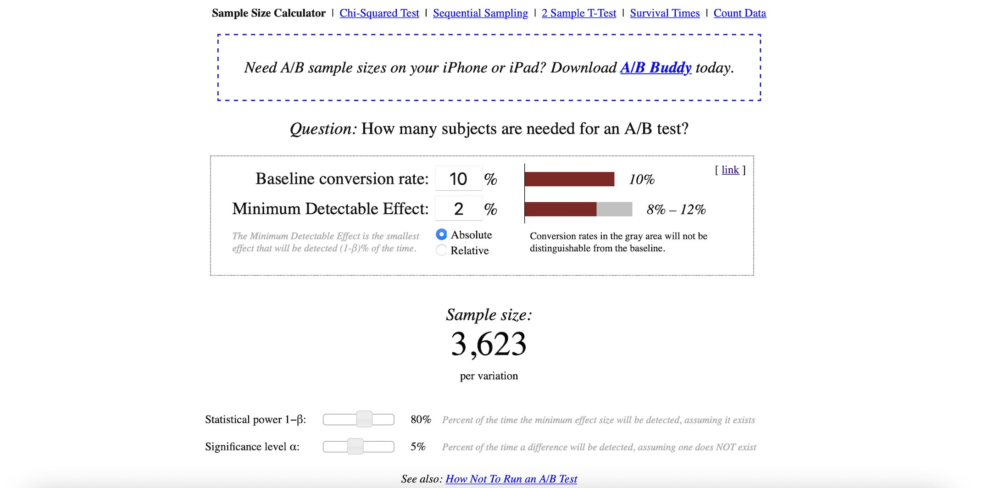

# Determine Sample Size for an A/B Test

## What is a “Sample Size”?

[[Statistics How To]][Sample Size in Statistics (How to Find it): Excel, Cochran’s Formula, General Tips]

A sample size is a **part of the population** chosen for a survey or experiment. For example, you might take a survey of dog owner’s brand preferences. You won’t want to survey all the millions of dog owners in the country (either because it’s too expensive or time consuming), so you take a sample size. That may be several thousand owners. The sample size is a representation of all dog owner’s brand preferences. If you choose your sample wisely, it will be a good representation.

## When Error can Creep in

When you only survey a **small** sample of the population, uncertainty creeps in to your statistics. If you can only survey a certain percentage of the true population, you can never be 100% sure that your statistics are a complete and accurate representation of the population. This uncertainty is called sampling error and is usually measured by a confidence interval. For example, you might state that your results are at a **90% confidence level**. That means if you were to **repeat** your survey over and over, **90% of the time your would get the results within the interval**.

## How to Find a Sample Size in Statistics

A sample is a percentage of the total population in statistics. You can use the data from a sample to make inferences about a population as a whole. For example, the standard deviation of a sample can be used to approximate the standard deviation of a population. Finding a sample size can be one of the most challenging tasks in statistics and depends upon many factors including the size of your original population.

Assume we have large enough populations. The margin of error is give by

Then given confidence level and margin of error, reversely the sample size needed per variation can be estimated by cochran formula [[Statistics How To]][Sample Size in Statistics (How to Find it): Excel, Cochran’s Formula, General Tips]:

Let's dive into how to actually calculate the sample size and timing you need for your next A/B test.

## Page View Example 

[Udacity](https://www.youtube.com/watch?v=WnQoZzxas-g&t=15s) shows the page view example to calculate sample size. Here we assume population is large enough (for internet, it is true). 

Assume the conversion rate is about 10%, and we want to run an A/B test. The minimum **effetc size** (practical significance level) to observe is 2%, such that the confidence interval is 8%-12%. Given significance level 0.05 and statistical power 80%, we can use the [online calculator](https://www.evanmiller.org/ab-testing/sample-size.html), and the interface looks like

Note the `absolute` is selected to make 8%-12% confidence interval. The online calculator shows at least we need sample size of 3,623 page views per variation (in each group) to see significant results in the AB test.

## Email Example

[[Ginny Mineo]][How to Determine Your A/B Testing Sample Size & Time Frame]

| Pred \ Actual | H0 is False | H0 is True | 
| :---: | :---: | :---: | 
| H0 is False |  |  | 
| H0 is True |  |  | 

| Effect size | r | 
| :---: | :---: | 
| Small | 0.1 |
| Medium | 0.3 |
| Large | 0.5 |

## Reference

[How to Determine Your A/B Testing Sample Size & Time Frame]: https://blog.hubspot.com/marketing/email-a-b-test-sample-size-testing-time
[[Ginny Mineo] How to Determine Your A/B Testing Sample Size & Time Frame](https://blog.hubspot.com/marketing/email-a-b-test-sample-size-testing-time)

[Sample Size in Statistics (How to Find it): Excel, Cochran’s Formula, General Tips]: https://www.statisticshowto.com/probability-and-statistics/find-sample-size/
[[Statistics How To] Sample Size in Statistics (How to Find it): Excel, Cochran’s Formula, General Tips](https://www.statisticshowto.com/probability-and-statistics/find-sample-size/)