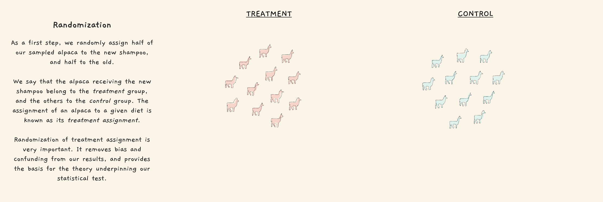
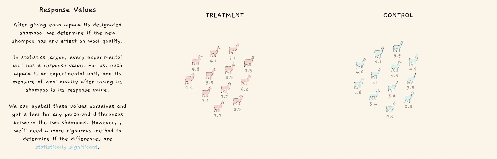
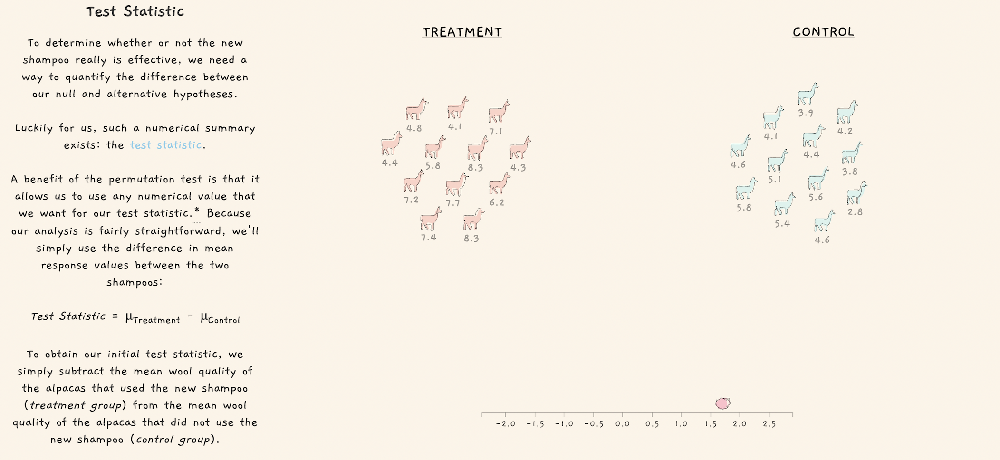
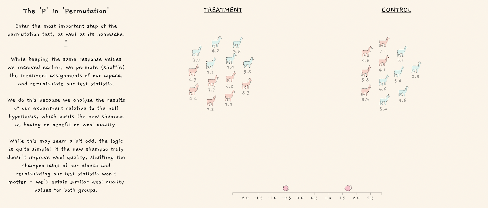
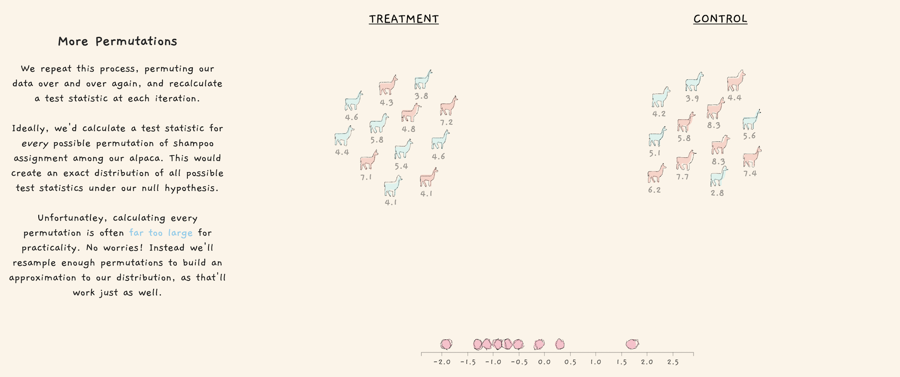
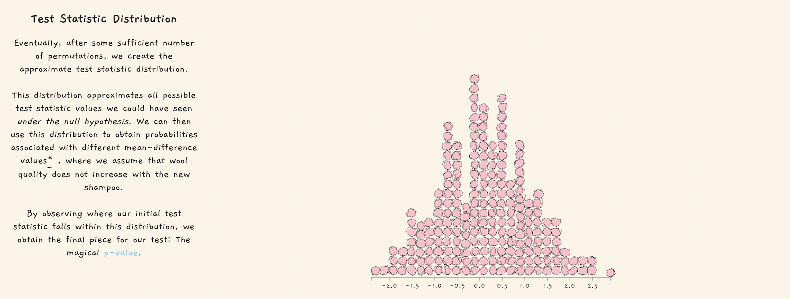
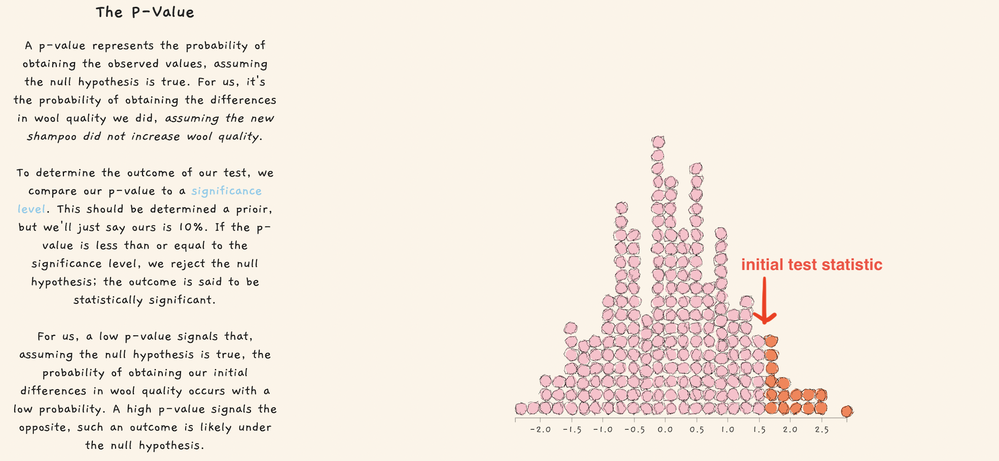
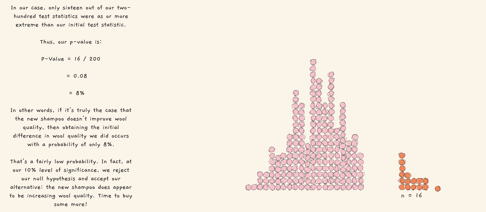

# Permutation Test

This page follows one of Jared Wilber's blog, which is a very awesome virtual explanation for the permutation test [[Jared Wilber]][The Permutation Test]. 

The main idea of permutation test (my understanding) is that, we want to see how likely the initial test statistic from our A/B test (between control and treatment groups) happens from test statistic variance within the population (if null hypothesis is true).

Note that a permutation test does not require data to be numeric or binary and sample sizes can be similar or different. Also, assumptions about normally distributed data are not needed [[Idil Ismiguzel]][A Guide to A/B Testing — How to Formulate, Design and Interpret].

The algorithm comprises the following steps:

1. Determine and calculate the initial test-statistic by control and treatment groups.
2. Permute the treatment assignment and construct test-statistic distribution.
3. Calculate the p-value by the initial test-statistic of the permutation distribution.

## Prcoess

Split smaple two groups: in the treatment group alpaca used new shampoo where in the control group only old shampoo. Note randomization of treatment assignment is very important.

Calculate initial test statistic from mean difference between control and treatment groups:

Reshuffle the treament group. Now in both the treament and control groups, there are alpaca using new and old shampoo. Then for each treatment assignment permutation, we calculate a test statistic:

More permutations generate more test statistics:

The test statistics generate a test statistic distribution. This distribution describes the test statistics variance if null hypothesis is true (no difference between control and treatment groups).

Then we want to see where the initial test statistic is, and we can compute p-value to know how likely it happens by chance:

The p-value is 16/200 = 8%. If significance level is 10% (as mentioned in Jared's blog), we can reject the null hypothesis. So the new shampoo is different from the old one.

#### Reference

[The Permutation Test]: https://www.jwilber.me/permutationtest/
[[Jared Wilber] The Permutation Test](https://www.jwilber.me/permutationtest/)

[A Guide to A/B Testing — How to Formulate, Design and Interpret]: https://towardsdatascience.com/a-guide-to-a-b-testing-how-to-formulate-design-and-interpret-f820cc62e21a
[[Idil Ismiguzel] A Guide to A/B Testing — How to Formulate, Design and Interpret](https://towardsdatascience.com/a-guide-to-a-b-testing-how-to-formulate-design-and-interpret-f820cc62e21a)
