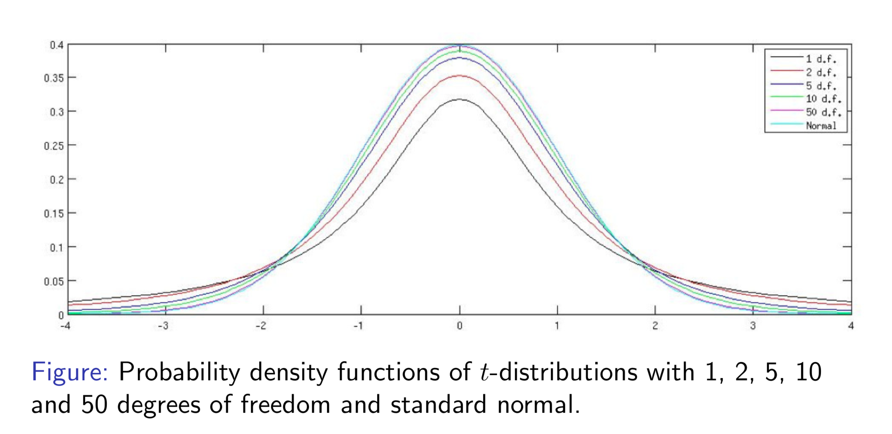
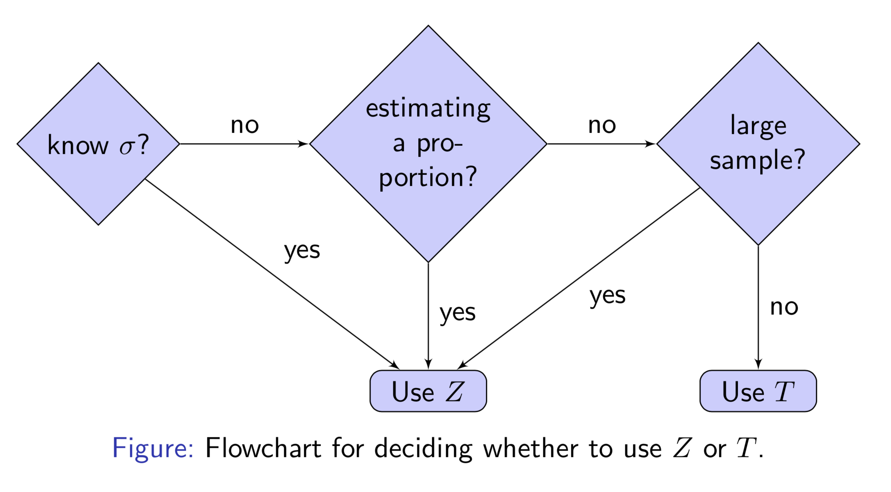

# t-test 

t-test is used when sample size is too small or population standard deviation is unknown. Note we have assumption the sample is approximate normal distribution.

## When to use t-test rather than Z-test

Suppose we have sample X = {X1, X2, ....Xn}, the sample mean is  and the population standard deviation is σ. Our null and alternative hypotheses are

Then the z-statistic computed from the sample is

If we do not know the population variance σ, we simply replaced it with the sample standard deviation s,

which is an estimate of σ from the sample.

Now we have similar format to z-statistic, t-statistic defined as

The distribution of T will be **more dispersed** than that of Z. This implies that you underestimate probabilities of extreme observations, such that you compute will be too narrow confidence intervals.

## Student’s t-Distribution

William Gossett computed the distribution of the t-statistic while working for the Guiness brewery, published it under the pseudonym Student, so called Student's t-distribution. He was concerned with **small sample sizes**.

The t-distribution has a single parameter called the number of degrees of freedom; his is equal to the sample size minus 1. For large samples, typically more than 50, the sample standard deviation is very accurate, and the t-distribution is close to a normal distribution. See below [[Massa]][S. Massa, t-Test].

For two-sided z-test and 95% confidence, the critical value of statisitic is 1.96. The t-test critical values for degree of freedoms (df) = 10 and 50 are 2.23 and 2.01, respectively. Thus we can see the t-distribution with df = 50 is quite close to a z-test.

The workflow to determine using z-test or t-test is as follows [[Massa]][S. Massa, t-Test]

## Paired t-test

The two-sample t-test is used to determine where the two samples are dependent and come in pair, like patents' reaction before and after treatment. The sample sizes are the same. For each sample observation, we need to compute the difference, and 

The test statistic is

## Two independent Sample t-Test

The two-sample t-test is used to determine if two population means are equal [[NIST Two-Sample t-Test]][NIST, 1.3.5.3. Two-Sample t-Test for Equal Means][[Plonsky]][M. Plonsky, Hypothesis Testing: Continuous Variables (2 Sample)]

If population standard deviations are known, then we have z-statistic

If the population standard deviations are unknown, the t-test test statistic is

where `s1` and `s2` are the sample variances. If equal variances are assumed, the test statistic becomes

where `sp` is the pool sample variance 

## Correction Factor

So far we have used the following formula for the standard error:

This is based on the premise that we are sampling from an infinite population [[Massa]][S. Massa, t-Test]. Usually sampling is performed from a finite population and without replacement.􏰔 In this case, if a **significant proportion of the population > 5% is sampled**, we need to use the correction factor, such that standard error becomes

## Reference

[S. Massa, t-Test]: http://www.stats.ox.ac.uk/~massa/Lecture%2010.pdf
[[Massa] S. Massa, t-Test](http://www.stats.ox.ac.uk/~massa/Lecture%2010.pdf)

[NIST, 1.3.5.3. Two-Sample t-Test for Equal Means]: https://www.itl.nist.gov/div898/handbook/eda/section3/eda353.htm
[[NIST Two-Sample t-Test] NIST, 1.3.5.3. Two-Sample t-Test for Equal Means](https://www.itl.nist.gov/div898/handbook/eda/section3/eda353.htm)

[M. Plonsky, Hypothesis Testing: Continuous Variables (2 Sample)]: https://www4.uwsp.edu/psych/stat/11/hyptest2s.htm
[[Plonsky] M. Plonsky, Hypothesis Testing: Continuous Variables (2 Sample)](https://www4.uwsp.edu/psych/stat/11/hyptest2s.htm)

