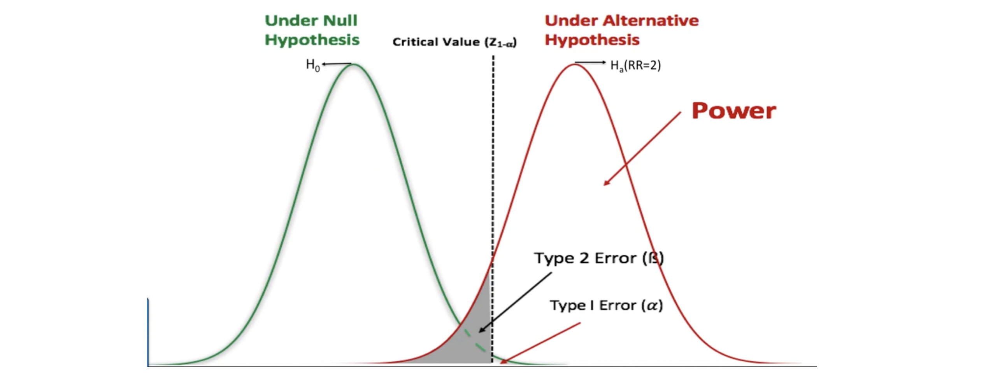
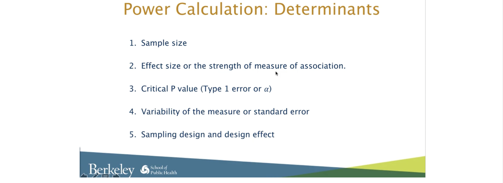
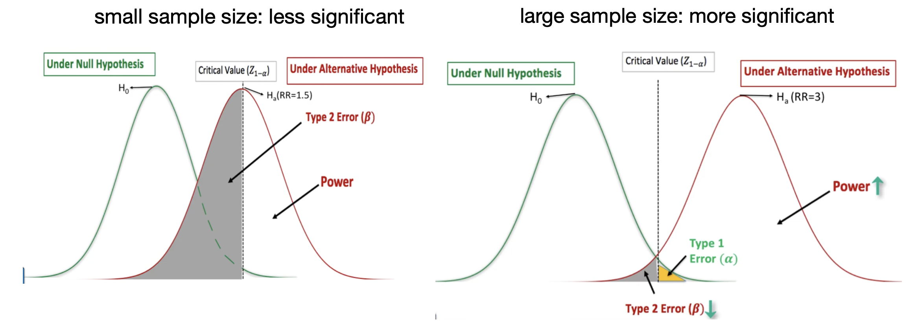
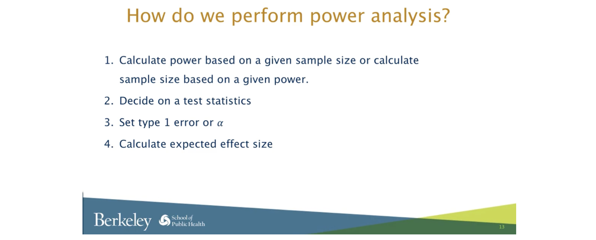
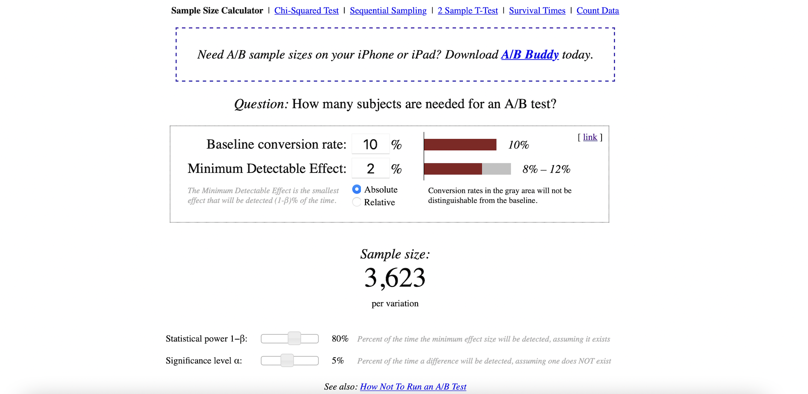

# Determine Sample Size for an A/B Test

### What is a “Sample Size”?

[[Statistics How To]][Sample Size in Statistics (How to Find it): Excel, Cochran’s Formula, General Tips]

A sample size is a **part of the population** chosen for a survey or experiment. For example, you might take a survey of dog owner’s brand preferences. You won’t want to survey all the millions of dog owners in the country (either because it’s too expensive or time consuming), so you take a sample size. That may be several thousand owners. The sample size is a representation of all dog owner’s brand preferences. If you choose your sample wisely, it will be a good representation.

## When Error can Creep in

When you only survey a **small** sample of the population, uncertainty creeps in to your statistics. If you can only survey a certain percentage of the true population, you can never be 100% sure that your statistics are a complete and accurate representation of the population. This uncertainty is called sampling error and is usually measured by a confidence interval. For example, you might state that your results are at a **90% confidence level**. That means if you were to **repeat** your survey over and over, **90% of the time your would get the results within the interval**.

## How to Find a Sample Size in Statistics

A sample is a percentage of the total population in statistics. You can use the data from a sample to make inferences about a population as a whole. For example, the standard deviation of a sample can be used to approximate the standard deviation of a population. Finding a sample size can be one of the most challenging tasks in statistics and depends upon many factors including the size of your original population.

The sample size calculation can be conducted in two ways: testing one population and testing difference of two populations.

Table of Contents:

* [1. Sample Size Calculation for Testing One Population Proportion](https://github.com/HsiangHung/Machine_Learning_Note/tree/master/Statistics/evaluate_sample_size#1-sample-size-calculation-for-testing-one-population-proportion)
     * [1.1 Large population](https://github.com/HsiangHung/Machine_Learning_Note/tree/master/Statistics/evaluate_sample_size#11-large-population)
     * [1.2 Samll population: modification for the Cochran Formula](https://github.com/HsiangHung/Machine_Learning_Note/tree/master/Statistics/evaluate_sample_size#12-samll-population-modification-for-the-cochran-formula)
     * [1.3 Examples](https://github.com/HsiangHung/Machine_Learning_Note/tree/master/Statistics/evaluate_sample_size#13-examples)
* [2. Power Analysis](https://github.com/HsiangHung/Machine_Learning_Note/tree/master/Statistics/evaluate_sample_size#2-power-analysis)
     * [2.1 ]()
     * [2.3 Udacity page view example](https://github.com/HsiangHung/Machine_Learning_Note/tree/master/Statistics/evaluate_sample_size#23-udacity-page-view-example)
* [3. Sample Size vs Conversion Rate and Minimum Detectable Effect](https://github.com/HsiangHung/Machine_Learning_Note/tree/master/Statistics/evaluate_sample_size#3-sample-size-vs-conversion-rate-and-minimum-detectable-effect)

## 1. Sample Size Calculation for Testing One Population Proportion

### 1.1 Large population

Assume we have large enough populations. The **margin of error** is given by

Then given values of **confidence level** and **margin of error**, reversely the sample size needed per variation can be estimated by cochran formula [[Statistics How To]][Sample Size in Statistics (How to Find it): Excel, Cochran’s Formula, General Tips]:

Suppose we are doing a study on the inhabitants of a **large** town, and want to find out how many households serve breakfast in the mornings. We don’t have much information on the subject to begin with, so we’re going to assume that half of the families serve breakfast: this gives us **maximum variability. So p = q = 0.5**. Now let’s say we want 95% confidence, and at least 5%—plus or minus—precision [[Statistics How To]][Sample Size in Statistics (How to Find it): Excel, Cochran’s Formula, General Tips], such that **MoE = 0.05**.

A 95 % confidence level gives us Z values of 1.96, per the normal tables, so we get

 
     round((1.96/0.05) * (1.96/0.05) * 0.5 * 0.5 ) + 1 = 385

So a random sample of 385 households in our target population should be enough to give us the confidence levels we need.

### 1.2 Samll population: modification for the Cochran Formula

If the population we’re studying is **small**, we can modify the sample size we calculated in the above formula by using this equation [[Statistics How To]][Sample Size in Statistics (How to Find it): Excel, Cochran’s Formula, General Tips], [[Survey Monkey]][Sample size calculator]:

Here `n0` is Cochran’s sample size recommendation, **N is the population size**, and `n` is the new, adjusted sample size. In our earlier example, `n0=385` and if there were just 1000 households in the target population, we would calculate

    385 / (1 + ( 384 / 1000 )) = 278

So for this smaller population, all we need are 278 households in our sample; a substantially smaller sample size.

This is the size **one your variations** needs to be. So for your email send, if you have one control and one variation, you'll need to double this number. If you had a control and two variations, you'd triple it. (And so on.) [[Ginny Mineo]][How to Determine Your A/B Testing Sample Size & Time Frame]

Here are the calculators from [survey system](https://www.surveysystem.com/sscalc.htm) and [survey monkey](https://www.surveymonkey.com/mp/sample-size-calculator/).

### 1.3 Examples

#### Given a confidence level and width, unknown population standard deviation

Example question: 41% of Jacksonville residents said that they had been in a hurricane. How many adults should be surveyed to estimate the true proportion of adults who have been in a hurricane, with a 95% confidence interval 6% wide?

z-score for 95% confidence interval is 1.96. The margin of error is given by the half width: 6% / 2 = 0.03. Gven percentage. p = 41% = 0.41, so q = 1-p = 0.59. If you aren’t given phat, use p = q = 50%. So the 

     (1.96/0.03) * (1.96/0.03) * 0.40 * 0.59 = 1033

1,033 people to survey.

#### Given a confidence level and width, known population standard deviation

Example question: Suppose we want to know the average age of an Florida State College student, plus or minus 0.5 years. We’d like to be 99% confident about our result. From a previous study, we know that the standard deviation for the population is 2.9.

      (2.58 * 2.9 / 0.5) * (2.58 * 2.9 / 0.5) = 223

## 2. Power Analysis

### 2.1 What is power?

    Power is the probability given Ho is false, we reject Ho. 

Given the null hypothesis Ho and alternative hypothesis Ha, if these distributions have less overlap, the testing is more significant, and power is higher. 

Therefore we can image an extreme case: without any overlap between Ho and Ha, power = 100%.

### 2.2 Power analysis

The factors to determine the power are

The simplest controllable factor to determine power is sample size. The sample size influence the distribution wide or narrow: larger sample size usually leads to smaller standard errors:

Therefore, to avoid p-hacking, before we run experimentation, we should perform power analysis to determine the minimum sample size.

### 2.3 Udacity page view example

[Udacity](https://www.youtube.com/watch?v=WnQoZzxas-g&t=15s) shows the page view example to calculate sample size. Here we assume population is large enough (for internet, it is true), but we demand statistical power. 

Assume the conversion rate is about 10%, and we want to run an A/B test. The minimum **effetc size** (practical significance level) to observe is 2%, such that the confidence interval is 8%-12%. Given significance level 5% and statistical power 80%, we can use another [online calculator](https://www.evanmiller.org/ab-testing/sample-size.html), and the interface looks like

Note the `absolute` is selected to make 8%-12% confidence interval. The online calculator shows at least we need sample size of 3,623 page views per variation (in each group) to see significant results in the AB test.

## 3. Sample Size vs Conversion Rate and Minimum Detectable Effect

Predicting how many users we need depends on a few factors, such as how big we think the difference will be between variants, how many variants there are, and what the conversion rates are. **The larger the difference between variants, the more confident you can be that the results are statistically significant with fewer samples.**

Here is a table of roughly how many users **per variant** (including baseline) we recommend using at the start of your test [[Apptimize]][How Many Users Do I Need for My A/B Test? Calculate Sample Size and Run Times]:

| | Low conversion rates (5%) | Medium conversion rates (15%) | High conversion rates (70%) |
| --- | --- | --- | --- |
| 10% lift between variants | 30,244 | 9,002 | 684 | 
| 20% lift between variants | 7,663 | 2,276 | 173 | 
| 50% lift between variants | 1,273| 375 |  |

The above numbers are obatined by the [online calculator](https://www.evanmiller.org/ab-testing/sample-size.html) setting 80% power and 5% significance level, and `Relative` in Minimum Detectable Effect.

### Runtimes

you can calculate about how long you will need to run your test to see conclusive results [[Apptimize]][How Many Users Do I Need for My A/B Test? Calculate Sample Size and Run Times]:

     Duration (weeks) = (Nv · Nu ) / (p · M/4 )

* Nv = number of variants
* Nu = number of users needed per variant (from the above table)
* p = fraction of users in this test (e.g., if this test runs on 5% of users, p = 0.05)
* M = MAU (monthly active users)

For instance, say you have two variants (baseline, plus one other), 100,000 MAUs, a current conversion rate of 10%, and an expected effect size of 20% (you expect the conversion rate of the new variant to be 12%). Then, if you run the test on 20% of your users, you will probably see conclusive results in about a week and a half.

## Reference

* [How Many Users Do I Need for My A/B Test? Calculate Sample Size and Run Times]: https://apptimize.com/blog/2014/01/how-many-users-time/
[[Apptimize] How Many Users Do I Need for My A/B Test? Calculate Sample Size and Run Times](https://apptimize.com/blog/2014/01/how-many-users-time/)
* [How to Determine Your A/B Testing Sample Size & Time Frame]: https://blog.hubspot.com/marketing/email-a-b-test-sample-size-testing-time
[[Ginny Mineo] How to Determine Your A/B Testing Sample Size & Time Frame](https://blog.hubspot.com/marketing/email-a-b-test-sample-size-testing-time)
* [Sample size calculator]: https://www.surveymonkey.com/mp/sample-size-calculator/
[[Survey Monkey] Sample size calculator](https://www.surveymonkey.com/mp/sample-size-calculator/)
* [Sample Size in Statistics (How to Find it): Excel, Cochran’s Formula, General Tips]: https://www.statisticshowto.com/probability-and-statistics/find-sample-size/
[[Statistics How To] Sample Size in Statistics (How to Find it): Excel, Cochran’s Formula, General Tips](https://www.statisticshowto.com/probability-and-statistics/find-sample-size/)