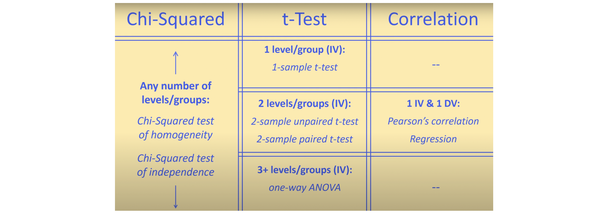

# Hypothesis Test

[[Statistics How to]][Hypothesis Testing]

* **Step 1**: State the Null hypothesis. 
* **Step 2**: State the Alternate Hypothesis.
* **Step 3**: Draw a picture to help you visualize the problem.
* **Step 4**: State the alpha level. If you aren’t given an alpha level, use 5% (0.05). 
* **Step 5**: Find the test statistic using this formula.
* **Step 6**: Determine if rejection the null hypothesis.

## One Sample Z Test

A principal at a certain school claims that the students in his school are above average intelligence. A random sample of thirty students IQ scores have a mean score of 112.5. Is there sufficient evidence to support the principal’s claim? The mean population IQ is 100 with a standard deviation of 15.

The p-value < α=0.05. Therefore we reject the null hypothesis; i.e. the students' IQ are higher than mean population IQ.

## Z Test or T Test?

The workflows to determine if using Z-test or T-test? Credits from [slide # 18 from S. Massa](http://www.stats.ox.ac.uk/~massa/Lecture%2010.pdf) and [From the Central Limit Theorem to the Z- and t-distributions](https://towardsdatascience.com/introduction-tfrom-the-central-limit-theorem-to-the-z-and-t-distributions-66513defb175).

Even though population is not skewed but if sample size is large (`n > 30`), we can still use t-test due to central limit theorem [[Javier Fernandez]][From the Central Limit Theorem to the Z- and t-distributions], [[Jonathan Bartlett]][The t-test and robustness to non-normality], [[The Role of Probability]][Central Limit Theorem]. However, if small sample size, we can use boostrapping to generate boostrapping distribution and evaluate the confidence interval [Coursera-Bootstrapping](https://www.coursera.org/learn/inferential-statistics-intro/lecture/u3k1n/bootstrapping).

## Chi-Square or T test?

Select various inference, depending on data type, categorical or numeric and purpose. See the youtube explanation [Choosing a Statistical Test for Your IB Biology IA](https://www.youtube.com/watch?v=ulk_JWckJ78)

If more than 2 groups to compare, we use ANOVA.

## Nonparametric Test

Nonparametric tests do not assume a specific distribution for the population, e.g. normality. These tests can be especially useful when you have a small sample that is skewed or a sample that contains several outliers [[Minitab]][What to do with nonnormal data].

| Test that assumes normality | Nonparametric test equivalent | 
| --- | --- | 
| 1-Sample Z, 1-sample-t | 1-Sample Sign, 1-Sample Wilcoxon | 
| 2-Sample t | Mann-Whitney | 
| ANOVA | Kruskal-Wallis, Mood's median, Friedman | 

Nonparametric tests are not completely free of assumptions about your data: for example, they still require the data to be an independent random sample.

#### Reference

* [From the Central Limit Theorem to the Z- and t-distributions]: https://towardsdatascience.com/introduction-tfrom-the-central-limit-theorem-to-the-z-and-t-distributions-66513defb175
[[Javier Fernandez] From the Central Limit Theorem to the Z- and t-distributions](https://towardsdatascience.com/introduction-tfrom-the-central-limit-theorem-to-the-z-and-t-distributions-66513defb175)
* [The t-test and robustness to non-normality]: https://thestatsgeek.com/2013/09/28/the-t-test-and-robustness-to-non-normality/
[[Jonathan Bartlett] The t-test and robustness to non-normality](https://thestatsgeek.com/2013/09/28/the-t-test-and-robustness-to-non-normality/)
* [What to do with nonnormal data]: https://support.minitab.com/en-us/minitab/19/help-and-how-to/statistics/basic-statistics/supporting-topics/normality/what-to-do-with-nonnormal-data/
[[Minitab] What to do with nonnormal data](https://support.minitab.com/en-us/minitab/19/help-and-how-to/statistics/basic-statistics/supporting-topics/normality/what-to-do-with-nonnormal-data/)
* [Hypothesis Testing]: https://www.statisticshowto.com/probability-and-statistics/hypothesis-testing/
[[Statistics How to] Hypothesis Testing](https://www.statisticshowto.com/probability-and-statistics/hypothesis-testing/)
* [Central Limit Theorem]: https://sphweb.bumc.bu.edu/otlt/mph-modules/bs/bs704_probability/BS704_Probability12.html
[[The Role of Probability] Central Limit Theorem](https://sphweb.bumc.bu.edu/otlt/mph-modules/bs/bs704_probability/BS704_Probability12.html)