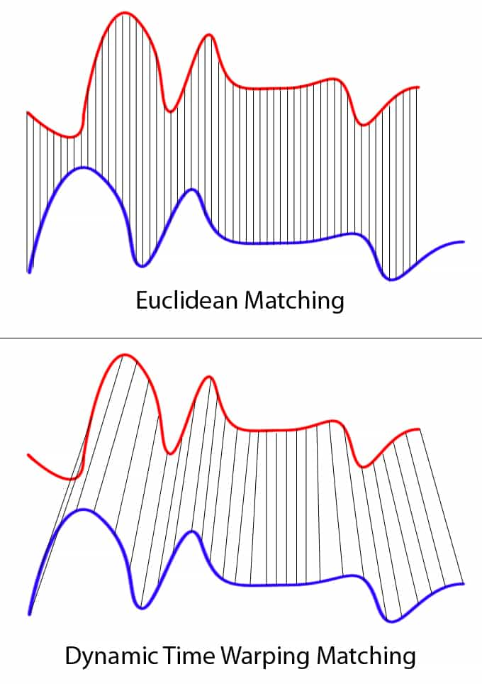

# MEASURE SIMILARITY

## 1. Correlation

## 2. Time-series data

### 2.1 Dynamic time warping
To measure the similarity between two time-series data, we can use [**Dynamic time warping**](https://en.wikipedia.org/wiki/Dynamic_time_warping).

The idea to compare arrays with different length is to build one-to-many and many-to-one matches so that the total distance can be minimised between the two. [[Ricardo Portilla and Brenner Heintz]][Understanding Dynamic Time Warping], [[Jeremy Zhang]][Dynamic Time Warping - Explanation and Code Implementation]

Suppose we have two different arrays red and blue with different length, [[Ricardo Portilla and Brenner Heintz]][Understanding Dynamic Time Warping] provided a good interpreation plot:



In Python, scipy supports a libray to compute dynamic time wrapping, see [Dynamic Time Warping (DTW)](https://dtaidistance.readthedocs.io/en/latest/usage/dtw.html):
```
from fastdtw import fastdtw
from scipy.spatial.distance import euclidean

x = np.array([1, 2, 3, 3, 7])
y = np.array([1, 2, 2, 2, 2, 2, 2, 4])

distance, path = fastdtw(x, y, dist=euclidean)

print(distance)
``` 
It returns distance = 5.


For the random samples we take from the population, we can compute the mean of the sample means:

<a href="https://www.codecogs.com/eqnedit.php?latex=\mu_{\bar{X}}&space;=&space;\mu" target="_blank"></a>

where <a href="https://www.codecogs.com/eqnedit.php?latex=\mu_{\bar{X}}" target="_blank"></a> (<a href="https://www.codecogs.com/eqnedit.php?latex=\bar{X}" target="_blank"></a> is called point estimate) came from the mean of <a href="https://www.codecogs.com/eqnedit.php?latex=\lbrace&space;\bar{X}_1,&space;\bar{X}_2,&space;\cdots,&space;\bar{X}_n&space;\rbrace" target="_blank"></a>, and the standard deviation of the sample means:

<a href="https://www.codecogs.com/eqnedit.php?latex=\sigma_{\bar{X}}&space;=&space;\frac{\sigma}{\sqrt{n}}" target="_blank"></a>


In the Coursera class, the CLT states:

The distribution of **sample mean** (sampling distribution) is nearly normal, center at the population mean, and with standard deviation equal to population standard deviation divided by squared root of the sample size

<a href="https://www.codecogs.com/eqnedit.php?latex=\bar{X}&space;=&space;\mathbb{N}(\textrm{mean}=\mu,&space;\textrm{SE}=\frac{\sigma}{\sqrt{n}})" target="_blank"></a>


#### Reference

* [How can we quantify similarity between time series?]: https://tech.gorilla.co/how-can-we-quantify-similarity-between-time-series-ed1d0b633ca0
[[Alexander Bader] How can we quantify similarity between time series?](https://tech.gorilla.co/how-can-we-quantify-similarity-between-time-series-ed1d0b633ca0)

* [Understanding Dynamic Time Warping]: https://www.databricks.com/blog/2019/04/30/understanding-dynamic-time-warping.html
[[Ricardo Portilla and Brenner Heintz] Understanding Dynamic Time Warping](https://www.databricks.com/blog/2019/04/30/understanding-dynamic-time-warping.html)

* [Dynamic Time Warping - Explanation and Code Implementation]: https://towardsdatascience.com/dynamic-time-warping-3933f25fcdd
[[Jeremy Zhang] Dynamic Time Warping - Explanation and Code Implementation](https://towardsdatascience.com/dynamic-time-warping-3933f25fcdd)

