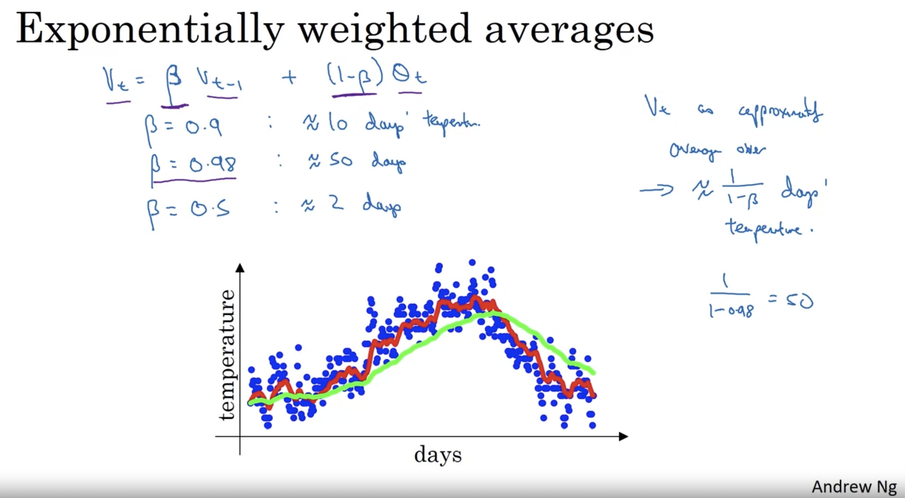
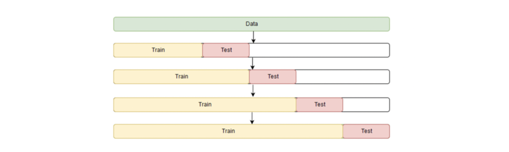

# Time Series 

## What is stationarity?

`X` is strictly stationary meaning if the distribution of (`x[t+1]`,…,`x[t+k]`) is identical to that of (`x[1]`,…,`x[k]`) for each t and k. From Wiki: a stationary process is a stochastic process whose joint **probability distribution does not change when shifted in time or space** (by IrishStat, [[StackExchange, 1]][Why does a time series have to be stationary?]). Consequently, a stationary time-series is one whose statistical properties such as **mean**, **variance**, **autocorrelation**, etc. are all **constant over time**. [[Robert Nau, Stationarity and differencing]][Stationarity and differencing]

Most statistical forecasting methods are based on the assumption that the time series can be rendered approximately stationary (i.e., "stationarized") through the use of mathematical transformations. Thus, finding the sequence of transformations to stationarize a time-series often provides important clues in the search for an appropriate forecasting model. 

It turns out that a lot of data becomes stationary after certain transformation. [ARIMA](https://people.duke.edu/~rnau/411arim.htm) model is a model for non-stationarity, by stationarizing a time-series through **differencing** (assumes that the data becomes stationary after differencing). If a series is stationary, we can just implement ARMA model (by mpiktas [[StackExchange, 1]][Why does a time series have to be stationary?] and ARIMAX model [[Rob Hyndman, ARIMAX]][The ARIMAX model muddle]). 

## Why time-series data needs to be stationary?

If the series is consistently increasing over time, the sample mean and variance will grow with the size of the sample, and they will always underestimate the mean and variance in future periods. 

In addition to this, stationary processes avoid the problem of **spurious regression**. 

## How to transform nonstationary time-series to be stationary?

Most business and economic time series are far from stationary when expressed in their original units of measurement, and even after deflation or seasonal adjustment they will typically still exhibit trends, cycles, random-walking, and other non-stationary behavior.

### Trend-stationary

If the series has a stable long-run trend and tends to revert to the trend line following a disturbance, it may be possible to stationarize it by de-trending (e.g., by fitting a trend line and subtracting it out prior to fitting a model, or else by including the time index as an independent variable in a regression or ARIMA model), perhaps in conjunction with logging or deflating. Such a series is said to be **trend-stationary**.

### Difference-stationary

Sometimes even de-trending is not sufficient to make the series stationary, however.
After detrending, if the mean, variance, and autocorrelations of the original series are still not constant in time, we may need to transform the de-trended series into a series of period-to-period and/or season-to-season differences. Such a series is said to be **difference-stationary**.

## 1. Time-Series Models

### 1.1 Exponentially Weighted Average

Suppose we have time-series data like day 1, temperature , day 2, temperature  .... etc, we can implement exponentially weighted avergae to fit the time series as follows (from Andrew Ng's class)

The value of  describes number of previous days used for weighted average. For example, if  = 0.9, data will decay to 1/e after 10 days; if 0.98 it is 50 days. 

### 1.2 AR(p) model

In a multiple regression model, we forecast the variable of interest using a linear combination of **past values** of the variable. The term autoregression indicates that it is a regression of the variable against itself.

The **AR(p)** mdoel of order p is a multiple regression but with lagged values of `Yt` as predictors [[Rob Hyndman: 8.4 Moving average models]][8.4 Moving average models]:

where the last term is white noise.

### 1.3 MA(q) model

Rather than using past values of the forecast variable in a regression, a moving average model uses past forecast errors in a regression-like model [[Rob Hyndman: 8.4 Moving average models]][8.4 Moving average models]

is referred as an **MA(q)** model, a moving average model of order q. `Yt` can be thought of as a weighted moving average of the past few forecast errors.

### 1.4 ARIMA(p,d,q) model

By Sunny Mewati [[Quora, 1]][What's the difference between ARMA, ARIMA, and ARIMAX, in layman's terms?], Box and Jenkins claimed (successfully) [[Box, Jenkins, Reinsel]][Time Series Analysis] that nonstationary data can be made stationary by differencing the series. This series,  is the input in Box-Jenkins analysis. 

If we combine **differencing** with autoregression and a moving average model, we obtain a non-seasonal ARIMA model [[Rob Hyndman: 8.5 Non-seasonal ARIMA models]][8.5 Non-seasonal ARIMA models]

where `ϕ` and `θ` are unknown parameters and `ϵ` are independent identically distributed error terms with zero mean; 
  is the differenced series (it may have been differenced more than once)

This model is called **Autoregressive Integrated Moving Average** or `ARIMA(p,d,q)` model of Y. `p` is the number of lagged values of  which represents the autoregressive (AR) nature of model, `q` is the number of lagged values of the error term which represents the moving average (MA) nature of model and `d` is the number of times Y has to be differences to produce the stationary .

The term **integrated** implies that in order to obtain a forecast of Y, we have to sum up (or **integrate over**) the values of  because  are the differenced values of the original series Y. If no differencing is involved, this model is called an Autoregressive Moving Average, i.e. `ARMA(p,q)`.

### 1.5 ARIMAX model

Econometricians developed another class of models that incorporated auroregressive and moving average components of Box-Jenkins approach with the ‘explanatory variables’ approach of standard econometrics [[Rob Hyndman, ARIMAX]][The ARIMAX model muddle]. The simplest of such models is the ARIMAX which is just an ARIMA with additional explanatory variables, written as

### 1.6 LSTM

* [Time Series Forecasting with the Long Short-Term Memory Network in Python]: https://machinelearningmastery.com/time-series-forecasting-long-short-term-memory-network-python/
[[Jason Brownlee-1] Time Series Forecasting with the Long Short-Term Memory Network in Python](https://machinelearningmastery.com/time-series-forecasting-long-short-term-memory-network-python/)

* [Time Series Prediction with LSTM Recurrent Neural Networks in Python with Keras]: https://machinelearningmastery.com/time-series-prediction-lstm-recurrent-neural-networks-python-keras/
[[Jason Brownlee-2] Time Series Prediction with LSTM Recurrent Neural Networks in Python with Keras](https://machinelearningmastery.com/time-series-prediction-lstm-recurrent-neural-networks-python-keras/)

### 1.7 Other models

FFT model and [Seq2Seq](https://google.github.io/seq2seq/). A talk in Youtube: [Two Effective Algorithms for Time Series Forecasting](https://www.youtube.com/watch?v=VYpAodcdFfA)

Code examples in [SARIMAX Introduction](https://www.statsmodels.org/dev/examples/notebooks/generated/statespace_sarimax_stata.html): Stata ARIMA time series in statmodel in Python.

Jose Marcial Portilla, [Using Python and Auto ARIMA to Forecast Seasonal Time Series](https://medium.com/@josemarcialportilla/using-python-and-auto-arima-to-forecast-seasonal-time-series-90877adff03c)

## 2. Handling Missing Values in Time Series

In time series data, if there are missing values, there are two ways to deal with the incomplete data:

* omit the entire record that contains information.
* Impute the missing information.

Since the time series data has temporal property, only some of the statistical methodologies are appropriate for time series data [[Kaggle: jingjuewang]][Handle Missing Values in Time Series For Beginners].

If we decomposite the time series data with linear regression model, it is:

where mt stands for trend, st stands for seasonality, and ϵt stands for random variables

Based on the equation above, there can be four types of time series data:

## 3. Cross Validation in Time Series

[[Soumya Shrivastava]][Cross Validation in Time Series]

[[Rob Hyndman, Cross-validation]][Cross-validation for time series]

[[Alexandra Amidon]][Don’t Use K-fold Validation for Time Series Forecasting]

# Reference

* [Don’t Use K-fold Validation for Time Series Forecasting]: https://towardsdatascience.com/dont-use-k-fold-validation-for-time-series-forecasting-30b724aaea64
[[Alexandra Amidon] Don’t Use K-fold Validation for Time Series Forecasting](https://towardsdatascience.com/dont-use-k-fold-validation-for-time-series-forecasting-30b724aaea64)
* [Time Series Analysis]: https://onlinelibrary.wiley.com/doi/book/10.1002/9781118619193
[[Box, Jenkins, Reinsel] Time Series Analysis](https://onlinelibrary.wiley.com/doi/book/10.1002/9781118619193)
* [Handle Missing Values in Time Series For Beginners]: https://www.kaggle.com/juejuewang/handle-missing-values-in-time-series-for-beginners
[[Kaggle: jingjuewang] Handle Missing Values in Time Series For Beginners](https://www.kaggle.com/juejuewang/handle-missing-values-in-time-series-for-beginners)
* [What's the difference between ARMA, ARIMA, and ARIMAX, in layman's terms?]: https://www.quora.com/Whats-the-difference-between-ARMA-ARIMA-and-ARIMAX-in-laymans-terms-What-exactly-do-P-D-Q-mean-and-how-do-you-know-what-to-put-in-for-them-in-say-R-1-0-2-or-2-1-1
[[Quora, 1] What's the difference between ARMA, ARIMA, and ARIMAX, in layman's terms?](https://www.quora.com/Whats-the-difference-between-ARMA-ARIMA-and-ARIMAX-in-laymans-terms-What-exactly-do-P-D-Q-mean-and-how-do-you-know-what-to-put-in-for-them-in-say-R-1-0-2-or-2-1-1)
* [8.3 Autoregressive models]: https://otexts.com/fpp2/AR.html
[[Rob Hyndman: 8.3 Autoregressive models] 8.3 Autoregressive models](https://otexts.com/fpp2/AR.html)
* [8.4 Moving average models]: https://otexts.com/fpp2/MA.html
[[Rob Hyndman: 8.4 Moving average models] 8.4 Moving average models](https://otexts.com/fpp2/MA.html)
* [8.5 Non-seasonal ARIMA models]: https://otexts.com/fpp2/non-seasonal-arima.html
[[Rob Hyndman: 8.5 Non-seasonal ARIMA models] 8.5 Non-seasonal ARIMA models](https://otexts.com/fpp2/non-seasonal-arima.html)
* [Cross-validation for time series]: https://robjhyndman.com/hyndsight/tscv/
[[Rob Hyndman, Cross-validation] Cross-validation for time series](https://robjhyndman.com/hyndsight/tscv/)
* [The ARIMAX model muddle]: https://robjhyndman.com/hyndsight/arimax/
[[Rob Hyndman, ARIMAX] The ARIMAX model muddle](https://robjhyndman.com/hyndsight/arimax/)
* [Stationarity and differencing]: https://people.duke.edu/~rnau/411diff.htm
[[Robert Nau, Stationarity and differencing] Stationarity and differencing](https://people.duke.edu/~rnau/411diff.htm)
* [ARIMA models for time series forecasting]: https://people.duke.edu/~rnau/411arim.htm
[[Robert Nau, ARIMA] ARIMA models for time series forecasting](https://people.duke.edu/~rnau/411arim.htm)
* [Why does a time series have to be stationary?]: https://stats.stackexchange.com/questions/19715/why-does-a-time-series-have-to-be-stationary
[[StackExchange, 1] Why does a time series have to be stationary?](https://stats.stackexchange.com/questions/19715/why-does-a-time-series-have-to-be-stationary)
* [Cross Validation in Time Series]: https://medium.com/@soumyachess1496/cross-validation-in-time-series-566ae4981ce4
[[Soumya Shrivastava] Cross Validation in Time Series](https://medium.com/@soumyachess1496/cross-validation-in-time-series-566ae4981ce4)
