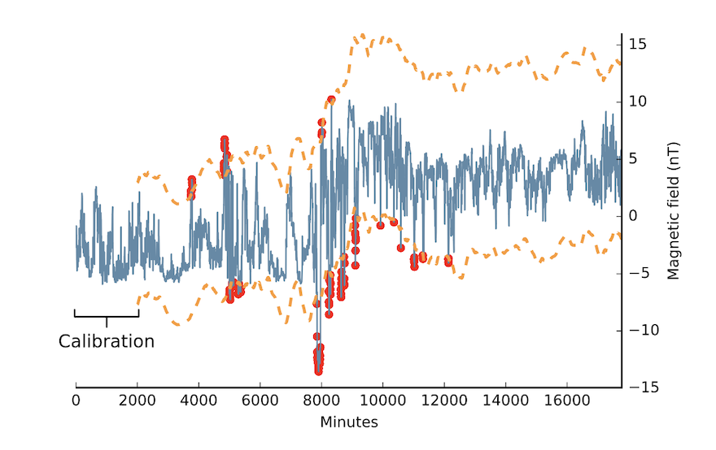

# DSPOT

## Introduction 

DSPOT is a drift stream POT method, fitting generalized Pareto distribution (GPD) to detect extreme values. In the paper [[Denis Sushentsev et. al. 2017]][Anomaly Detection in Streams with Extreme Value Theory], the DSPOT algorithm only focuses on upper extremem values. To detect both upper and lower extreme extreme values, we use the specific variant of DSPOT, called biDSPOT.

Assume we have an extreme value distribution. The Pickands-Balkema-de Haan theorem states, that there exists a cumulative distribution function $F(x)$, which reads as

$$\bar{F}_t(x) = P( X - t > x | X > t) \sim \Big[ 1 + \frac{\gamma}{\sigma}(x - \mu) \Big]^{-\frac{1}{\gamma}}$$

as the extreme laws in the extreme value distribution (EVD). The probability descreases as $P(X > x) \to 0$ when x increases.

The distribution has $iid$ random vairables $X > t$, with asymptotic power-law tail behavior. Note in the above $\gamma \ne 0$ is required. The actual cumulative distribution function then reads as 

$$ F = 1 - \bar{F}.$$

The above function $F(t)$ is called GPD, with parameter of $\gamma$, $\sigma$ and $\mu$. In the paper [[Denis Sushentsev et. al. 2017]][Anomaly Detection in Streams with Extreme Value Theory], $\mu$ is simply set as $\mu = 0$. Then we have

$$\bar{F}_t(x) \sim \Big( 1 + \frac{\gamma}{\sigma} x \Big)^{-\frac{1}{\gamma}}.$$

Rather than fitting an EVD to the extreme values of $X$, the DSPOT paper used the peak-over-threshold (POT) approach to fit the GPD to the excesses, $i.e.$ $X-t$.

## Extreme Value Threshold $z_q$ Determination

### A. $z_q$ for $\gamma \ne 0$

Given $\gamma$ (and $\gamma \ne 0$) and $\sigma$, we need to estimate the **upper** extreme value threshold $z_q$, and then evaluate the probability of $P(X > z_q) < q$, given a desired probability $q$. (here $q$ is usually a small number, like 0.001, 0.0001... etc)

Assume $n$ is the total number of observations (data points) and $N_t$ is the number of peaks (meaning the number of data points having $X > t$), the probability can be evaluated as

$$\bar{F}_t(x) = \frac{q}{(\frac{N_t}{n})} = \frac{qn}{N_t} \sim \left[ 1 + \frac{\gamma}{\sigma} (z_q - t) \right]^{-\frac{1}{\gamma}}$$

By simple algebra, the upper extremem value threshold $z^u_q$ is given by

$$z^u_q = z_q \simeq t + \frac{\sigma}{\gamma}\left[ \Big( \frac{qn}{N_t}\Big)^{-\gamma} -1 \right],$$

where in the upper GPD, we have $z^u_q > t$ and superscript $u$ denotes *upper*. This is Eq. (1) of the paper [[Denis Sushentsev et. al. 2017]][Anomaly Detection in Streams with Extreme Value Theory]. On the other hand, for **lower** extreme value threshold $z^l_q$, the probability is 

$$\bar{F}_t(x) = \frac{qn}{N_t} \sim \left[ 1 + \frac{\gamma}{\sigma} ( t - z_q ) \right]^{-\frac{1}{\gamma}},$$

due to $ z_q < t$ in the lower GPD. Then

$$z^l_q = z_q \simeq t - \frac{\sigma}{\gamma}\left[ \Big( \frac{qn}{N_t}\Big)^{-\gamma} -1 \right].$$

### B. $z_q$ for $\gamma = 0$

For the $\gamma = 0$ case, the cumulative distribution $\bar{F}_t(x)$ turns out to be

$$ \bar{F}_t(x) \sim e^{-(x-\mu)/ \sigma}, $$

which has exponential tail asymptotic behavior, rather than asymptotic power-law tail behavior. The upper extremem value GPD, $z^u_q$ can be derived as 

$$\frac{qn}{N_t} \sim e^{-(z_q -t)/\sigma} \ \to \ z^u_q = z_q \simeq t - \sigma \ln \Big( \frac{qn}{N_t} \Big).$$

On the other hand, in the lower extremem value GPD, the threshold $z^l_q$ is given as 

$$\frac{qn}{N_t} \sim e^{-(t - z_q)/\sigma} \ \to \ z^l_q = z_q \simeq t + \sigma \ln \Big( \frac{qn}{N_t} \Big).$$

## Log-Likelihood Function

The cumulative distribution $F(x)$ is defined as the integral over the probability probability $P(x^{\prime})$, such that

$$F(x) = \int^{x}_0 P(x^{\prime}) dx^{\prime} = 1 - \bar{F}_t(x) = 1 - \left( 1 + \frac{\gamma}{\sigma}x \right)^{-\frac{1}{\gamma}}.$$

Therefore, taking the derivative of the cumulative function, the probability density function $P(x)$ turns out to be either, if $\gamma \ne 0$:

$$P(x) = \frac{1}{\sigma}\left( 1 + \frac{\gamma}{\sigma}x \right)^{(1+\frac{1}{\gamma})}, $$

or 

$$P(x) = \frac{1}{\sigma} e^{-x/ \sigma}, $$

for $\gamma = 0$.

The log-likelihood function to maximize is defined as 

$$\log L(\gamma, \sigma, X) = \log \prod^{N_t}_i P(x_i)  = \sum^{N_t}_i \log P(x_i).$$

For $\gamma \ne 0$, we have 

$$\log L(\gamma, \sigma, X) = \sum^{N_t}_i \log \left[ \frac{1}{\sigma}\left( 1 + \frac{\gamma}{\sigma} x_i \right)^{(1+\frac{1}{\gamma})} \right] = -N_t \log \sigma - (1+\frac{1}{\gamma}) \sum^{N_t}_i \log \Big( 1 + \frac{\gamma}{\sigma} x_i \Big)$$

or 

$$ \log L(\gamma, \sigma, X) = \sum^{N_t}_i \log \big( \frac{1}{\sigma} e^{-x_i/ \sigma} \big) =  - N_t \log \sigma - \frac{1}{\sigma} \sum^{N_t}_i x_i, $$

if $\gamma = 0$.

## Example

# Reference

* [Anomaly Detection in Streams with Extreme Value Theory]: https://hal.archives-ouvertes.fr/hal-01640325/document
[[Denis Sushentsev et. al. 2017] Anomaly Detection in Streams with Extreme Value Theory](https://hal.archives-ouvertes.fr/hal-01640325/document)

