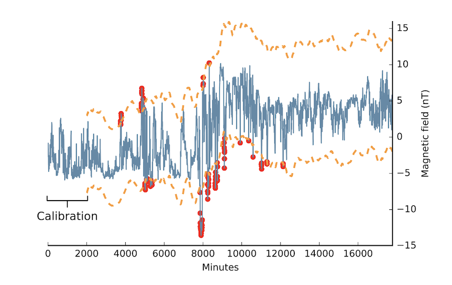

# DSPOT

## Introduction 

DSPOT is a drift stream POT method, fitting generalized Pareto distribution (GPD) to detect extreme values. In the paper [[Alban Siffer et. al. 2017]][Anomaly Detection in Streams with Extreme Value Theory], the DSPOT algorithm only focuses on anomaly detection on upper extremem values. To detect both upper and lower extreme extreme values, we generalize the variant of DSPOT below.

Assume we have an extreme value distribution. The Pickands-Balkema-de Haan theorem states, that there exists a cumulative distribution function $F(x)$, which reads as

$$\bar{F}_t(x) = P( X - t > x | X > t) \sim \Big[ 1 + \frac{\gamma}{\sigma}(x - \mu) \Big]^{-\frac{1}{\gamma}}$$

as the extreme laws in the extreme value distribution (EVD). The probability descreases as $P(X > x) \to 0$ when x increases.

The distribution has $iid$ random vairables $X > t$, with asymptotic power-law tail behavior. Note in the above $\gamma \ne 0$ is required. The actual cumulative distribution function then reads as 

$$ F = 1 - \bar{F}.$$

The above function $F(t)$ is called GPD, with parameter of $\gamma$, $\sigma$ and $\mu$. In the paper [[Alban Siffer et. al. 2017]][Anomaly Detection in Streams with Extreme Value Theory], $\mu$ is simply set as $\mu = 0$. Then we have

$$\bar{F}_t(x) \sim \Big( 1 + \frac{\gamma}{\sigma} x \Big)^{-\frac{1}{\gamma}}.$$

Rather than fitting an EVD to the extreme values of $X$, the DSPOT paper used the peak-over-threshold (POT) approach [[GitHub]][GitHub:model-pot, Peak over Threshold] to fit the GPD to the excesses, $i.e.$ $X-t$. The DSPOT code implemented grimshaw to fit $gamm$ and $sigma$.


## Extreme Value Threshold $z_q$ Determination

### A. $z_q$ for $\gamma \ne 0$

Given $\gamma$ (and $\gamma \ne 0$) and $\sigma$, we need to estimate the extreme value threshold $z_q$. For **upper** extreme value threshold, we evaluate the probability of $P(X > z_q) < q$, given a desired probability $q$. (here $q$ is usually a small number, like 0.001, 0.0001... etc)

Assume $n$ is the total number of observations (data points) and $N_t$ is the number of peaks (meaning the number of data points having $X > t$), the probability can be evaluated as

$$\bar{F}_t(x) = \frac{q}{(\frac{N_t}{n})} = \frac{qn}{N_t} \sim \left[ 1 + \frac{\gamma}{\sigma} (z_q - t) \right]^{-\frac{1}{\gamma}}$$

By simple algebra, the upper extreme value threshold $z^u_q$ is given by

$$z^u_q = z_q \simeq t + \frac{\sigma}{\gamma}\left[ \Big( \frac{qn}{N_t}\Big)^{-\gamma} -1 \right],$$

where in the upper GPD, we have $z^u_q > t$ and superscript $u$ denotes *upper*. This is Eq. (1) of the paper [[Alban Siffer et. al. 2017]][Anomaly Detection in Streams with Extreme Value Theory]. On the other hand, for **lower** extreme value threshold $z^l_q$, the probability is 

$$\bar{F}_t(x) = \frac{qn}{N_t} \sim \left[ 1 + \frac{\gamma}{\sigma} ( t - z_q ) \right]^{-\frac{1}{\gamma}},$$

due to $ z_q < t$ in the lower GPD. Then

$$z^l_q = z_q \simeq t - \frac{\sigma}{\gamma}\left[ \Big( \frac{qn}{N_t}\Big)^{-\gamma} -1 \right],$$

where in $z^l_q$ the superscript denotes *lower*.

The above derivation can refer to the code https://github.com/cbhua/model-pot/blob/main/src/dspot.py#L51:
```Python
r = k * risk / peaks.size
z = t + (sigma / gamma) * (pow(r, -gamma) - 1)
```

### B. $z_q$ for $\gamma = 0$

For the $\gamma = 0$ case, the cumulative distribution $\bar{F}_t(x)$ turns out to be

$$ \bar{F}_t(x) \sim e^{-(x-\mu)/ \sigma}, $$

which has exponential tail asymptotic behavior, rather than asymptotic power-law tail behavior. The upper extreme value GPD, $z^u_q$ can be derived as 

$$\frac{qn}{N_t} \sim e^{-(z_q -t)/\sigma} \ \to \ z^u_q = z_q \simeq t - \sigma \ln \Big( \frac{qn}{N_t} \Big).$$

This corresponds to the code in https://github.com/cbhua/model-pot/blob/main/src/pot.py#L40
```Python
z = t + (sigma / gamma) * (pow(r, -gamma) - 1)
```

On the other hand, in the lower extremem value GPD, the threshold $z^l_q$ is given as 

$$\frac{qn}{N_t} \sim e^{-(t - z_q)/\sigma} \ \to \ z^l_q = z_q \simeq t + \sigma \ln \Big( \frac{qn}{N_t} \Big),$$

corresponding to https://github.com/cbhua/model-pot/blob/main/src/pot.py#L42
```Python
z = t - sigma * log(r)
```


## Log-Likelihood Function

The cumulative distribution $F(x)$ is defined as the integral over the probability probability $P(x^{\prime})$, such that

$$F(x) = \int^{x}_0 P(x^{\prime}) dx^{\prime} = 1 - \bar{F}_t(x) = 1 - \left( 1 + \frac{\gamma}{\sigma}x \right)^{-\frac{1}{\gamma}}.$$

Therefore, taking the derivative of the cumulative function, the probability density function $P(x)$ turns out to be either, if $\gamma \ne 0$:

$$P(x) = \frac{1}{\sigma}\left( 1 + \frac{\gamma}{\sigma}x \right)^{(1+\frac{1}{\gamma})}, $$

or 

$$P(x) = \frac{1}{\sigma} e^{-x/ \sigma}, $$

for $\gamma = 0$.

The log-likelihood function to maximize is defined as 

$$\log L(\gamma, \sigma, X) = \log \prod^{N_t}_i P(x_i)  = \sum^{N_t}_i \log P(x_i).$$

For $\gamma \ne 0$, we have 

$$\log L(\gamma, \sigma, X) = \sum^{N_t}_i \log \left[ \frac{1}{\sigma}\left( 1 + \frac{\gamma}{\sigma} x_i \right)^{(1+\frac{1}{\gamma})} \right] = -N_t \log \sigma - (1+\frac{1}{\gamma}) \sum^{N_t}_i \log \Big( 1 + \frac{\gamma}{\sigma} x_i \Big)$$

This corresponds to the code in https://github.com/cbhua/model-pot/blob/main/src/pot.py#L40
```Python
z = t + (sigma / gamma) * (pow(r, -gamma) - 1)
```

For $\gamma = 0$, 

$$ \log L(\gamma, \sigma, X) = \sum^{N_t}_i \log \big( \frac{1}{\sigma} e^{-x_i/ \sigma} \big) =  - N_t \log \sigma - \frac{1}{\sigma} \sum^{N_t}_i x_i, $$

corresponding to https://github.com/cbhua/model-pot/blob/main/src/pot.py#L42
```Python
z = t - sigma * log(r)
```

The liklihood evaluation corresponds to the code: https://github.com/cbhua/model-pot/blob/main/src/utils/grimshaw.py#L101
```Python
def cal_log_likelihood(peaks, gamma, sigma):
    if gamma != 0:
        tau = gamma/sigma
        log_likelihood = -peaks.size * log(sigma) - (1 + (1 / gamma)) * (np.log(1 + tau * peaks)).sum()
    else: 
        log_likelihood = peaks.size * (1 + log(peaks.mean()))
    return log_likelihood
```


## Example

In the paper [[Alban Siffer et. al. 2017]][Anomaly Detection in Streams with Extreme Value Theory], the authors demo an example as below. The dash orange lines are upper and lower extremem value boundaries, $z^u_q$ and $z^l_q$. The red dots are anomalies.



# Reference

* [Anomaly Detection in Streams with Extreme Value Theory]: https://hal.archives-ouvertes.fr/hal-01640325/document
[[Alban Siffer et. al. 2017] Anomaly Detection in Streams with Extreme Value Theory](https://hal.archives-ouvertes.fr/hal-01640325/document)
* [slides: Anomaly Detection in Streams with Extreme Value Theory]: https://project.inria.fr/FranceJapanICST/files/2017/05/ASiffer_Presentation_2017.pdf
[[Alban Siffer et. al. 2017] slides: Anomaly Detection in Streams with Extreme Value Theory](https://project.inria.fr/FranceJapanICST/files/2017/05/ASiffer_Presentation_2017.pdf)
* [GitHub:model-pot, Peak over Threshold]: https://github.com/cbhua/model-pot
[[GitHub] GitHub:model-pot, Peak over Threshold](https://github.com/cbhua/model-pot)